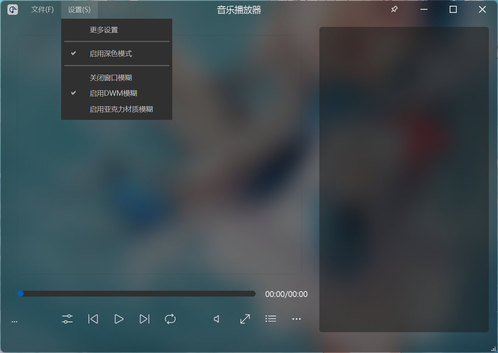
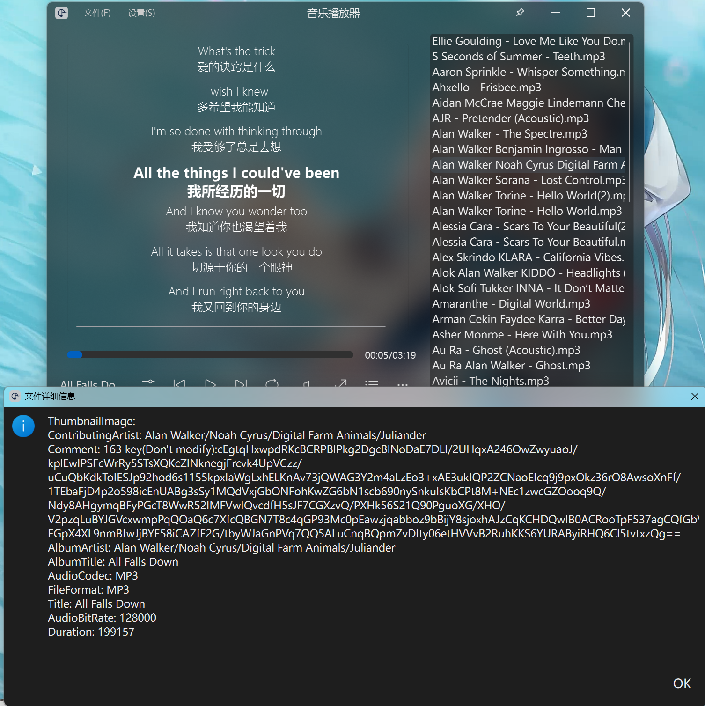
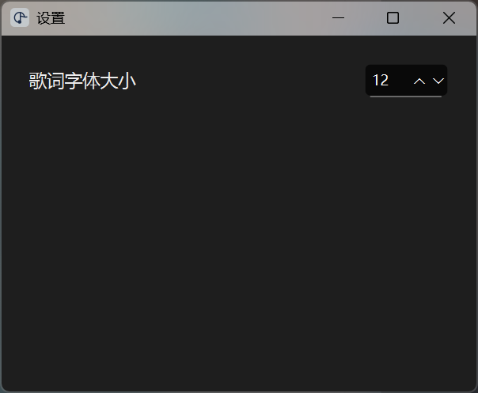
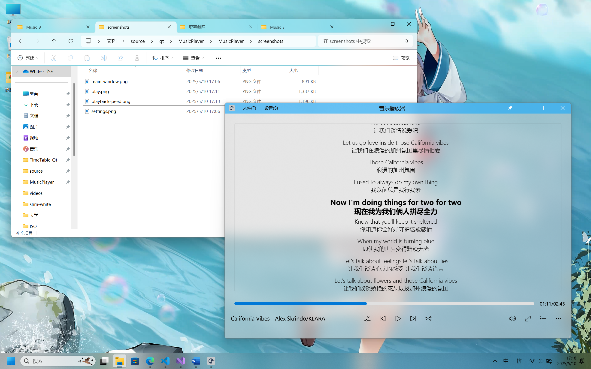

# 音乐播放器项目设计报告

## 1. 需求分析

### 系统功能说明

- **播放功能**：支持播放、暂停、上一曲、下一曲等基本操作。
- **播放列表管理**：支持添加、删除、清空播放列表。
- **文件信息显示**：显示当前播放音乐的详细信息。
- **多语言支持**：支持中文和其他语言切换。
- **跨平台支持**：支持 Windows 和其他主流操作系统。

---

## 2. 架构设计

### 系统总框图

---

## 3. 模块设计
### 1. **主界面模块（MainWidget）**

* 负责主窗口的显示和交互。
* 包括播放控制按钮、播放列表、歌词显示等功能。

### 2. **播放控制模块**

* 控制音乐的播放、暂停、上一曲、下一曲等操作。
* 包括播放模式切换（如随机播放、单曲循环）。
* 相关类：
  * `PlayPauseButton`
  * `LoopModeSwitcher`

### 3. **播放列表模块**

* 管理音乐文件的添加、删除、清空等操作。
* 相关类：
  * `MusicItem`

### 4. **歌词显示模块**

* 显示当前播放音乐的歌词，并支持滚动和高亮。
* 相关类：
  * `DisplayWidget`
  * `LyricsDelegate`

### 5. **音量控制模块**

* 控制音量大小，支持静音功能。
* 相关类：
  * `ChangeVolumeButton`
  * `ChangeVolumeWidget`

### 6. **播放速度控制模块**

* 调节音乐播放速度。
* 相关类：
  * `ChangePlaybackSpeedButton`
  * `ChangePlaybackSpeedWidget`

### 7. **设置模块**

* 提供用户界面，用于调整字体大小、主题等设置。
* 相关类：
  * `Settings`

### 8. **配置管理模块**

* 负责保存和加载用户设置及播放列表。
* 相关类：
  * `ConfigManager`

### 9. **全局配置模块**

* 定义全局变量和常量，如配置文件路径、应用设置等。
* 相关类：
  * `GlobalConfigs`

### 11. **基础组件模块**

* 提供基础的 UI 组件和工具类。
* 相关类：
  * `BasicWidget`

### 12. **算法模块**

* 实现随机播放和异步加载元数据等功能。
* 相关代码：
  * 随机播放算法
  * 异步加载算法

### 13. **多语言支持模块**

* 提供中文和英文的界面翻译。
* 相关文件：
  * `MusicPlayer_zh_CN.ts`

### 14. **样式与主题模块**

* 提供深色和浅色主题切换功能。
* 相关代码：
  * `loadStyleSheet`方法

### 15. **跨平台支持模块**

* 使用 `QWindowKit` 实现跨平台的窗口管理和样式支持。

---

## 4. 类与函数定义

### MainWidget

```cpp
class MainWidget : public QMainWindow
{
    Q_OBJECT

public:
    MainWidget(QWidget *parent = nullptr);
    ~MainWidget();
    Theme currentTheme{};
    QWK::WidgetWindowAgent *windowAgent;

Q_SIGNALS:
    void themeChanged(Theme t);

protected:
    void resizeEvent(QResizeEvent* event) override;
    void dragEnterEvent(QDragEnterEvent *event) override;
    void dropEvent(QDropEvent *event) override;
    void keyPressEvent(QKeyEvent* event) override;

protected Q_SLOTS:
    void updateMusicList(const QStringList& list);
    void changeMusic(QListWidgetItem* item);
    void on_volumeChanged(int value);
    void on_positionChanged(qint64 value);
private slots:
    void on_pushButton_ShowPlayList_clicked();
    void on_playPauseButton_clicked();
    void on_horizontalSlider_Progress_valueChanged(int value);
    void on_horizontalSlider_Progress_sliderReleased(); 
    void showContextMenu(const QPoint &pos);
    void removeSelectedItem(QListWidgetItem *item);
    void on_loopModeSwitched(LoopModeSwitcher::Mode mode);
    void on_mediaStatusChanged(QMediaPlayer::MediaStatus status);
    void on_enableListWidget();
    void on_pushButton_Previous_clicked();
    void on_pushButton_Next_clicked();
    void on_pushButton_Maximize_clicked();
    void on_pushButton_showFileDetails_clicked();

private:
    void installWindowAgent();
    void loadStyleSheet(Theme theme);
    bool event(QEvent* event) override;
    void paintEvent(QPaintEvent* event) override;
    void updateTimeLabel(qint64 current, qint64 total);
    void updateMusicNameLabel(const QString& musicInfo, int availableWidth);
    Ui::MainWidget *ui;
    bool m_paintTransparentBackground{ true };
    std::shared_ptr<QMediaPlayer> m_mediaPlayer;
    QMediaMetaData m_currentMetaData;
    std::unique_ptr<QTimer> m_playTimer;
    QString m_currentMusicInfo{ QStringLiteral("...") };
    QListWidgetItem* m_playingMusicItem{ nullptr };
    QStringList m_musicList;
    LoopModeSwitcher::Mode m_loopMode = LoopModeSwitcher::Mode::ListLoop;
    std::unique_ptr<QTimer> m_playbackTimer;
    std::unique_ptr<QTimer> m_autoFocusTimer;
    std::vector<QListWidgetItem*> m_playedMusics;
};

```

### MusicItem

```cpp
class MusicItem : public QListWidgetItem
{
	//Q_OBJECT

public:
	QUrl url;
	MusicItem(QListWidget *parent, const QUrl& url);
	~MusicItem();
	QFuture<QMediaMetaData> load(std::shared_ptr<QMediaPlayer>& player);
    QMediaMetaData mediaMetaData() const;
private:
	void updateText();
    QMediaMetaData m_mediaMetaData;
};
```

### Settings

```cpp
class Settings : public BasicWidget
{
    Q_OBJECT

public:
    explicit Settings(QWidget *parent = nullptr);
    ~Settings();
  
private slots:
    void on_spinBox_fontSize_valueChanged(int arg1);

private:
    Ui::Settings* ui;
protected:
    void closeEvent(QCloseEvent* event) override;
};
```

### PlayPauseButton

```cpp
class PlayPauseButton : public QPushButton
{
	Q_OBJECT

public:
	PlayPauseButton(QWidget* parent);
	~PlayPauseButton();
	bool isPlaying() const;
	PlayPauseButton& setIsPlaying(bool isPlaying);

Q_SIGNALS:
	void PlayPauseClicked();
	void IsPlayingChanged(bool);

protected:
	void mousePressEvent(QMouseEvent* event) override {
		if (event->button() == Qt::MouseButton::LeftButton) {
			setIsPlaying(!isPlaying());
			emit PlayPauseClicked();
		}
		QPushButton::mousePressEvent(event);
	}
private:
	void _updateText();
	bool _isPlaying{ false };
};
```

### LoopModeSwitcher

```cpp
class LoopModeSwitcher : public QPushButton {
    Q_OBJECT

public:
    enum Mode {
        ListLoop,
        SingleLoop,
        RandomPlay
    };
    Q_ENUM(Mode)

    explicit LoopModeSwitcher(QWidget* parent = nullptr);

    Mode currentMode() const;

signals:
    void playModeSwitched(Mode mode);

private slots:
    void switchMode();

private:
    Mode mode{ ListLoop };
    void updateIcon();
};
```

### LyricsDelegate

```cpp
class LyricsDelegate : public QStyledItemDelegate
{
    Q_OBJECT

public:
    explicit LyricsDelegate(QObject *parent = nullptr);

    void setHighlightedIndex(int index);
    void setMaxWidth(int width); // New method to set maximum width for lyrics

    void paint(QPainter *painter, const QStyleOptionViewItem &option, const QModelIndex &index) const override;
    QSize sizeHint(const QStyleOptionViewItem &option, const QModelIndex &index) const override;

private:
    int highlightedIndex;
    int maxWidth; // Stores the maximum width for lyrics
};

```

### GlobalConfigs

```cpp
class GlobalConfigs {
public:
	static inline const QString CONFIG_FILE_PATH() {
		return QCoreApplication::applicationDirPath() + QStringLiteral("/config.cfg");
	}
	static inline const QString LOCAL_PLAY_LIST() {
		return QCoreApplication::applicationDirPath() + QStringLiteral("/local.playlist");
	}
	static inline QMap<QString, QVariant> APPLICATION_SETTINGS;
};
```

### DisplayWidget

```cpp
class DisplayWidget : public QWidget
{
    Q_OBJECT

public:
    DisplayWidget(QWidget *parent = nullptr);
    ~DisplayWidget();

    void updateMetaData(const QString &musicFilePath, const QPixmap &albumCover);
    void loadLyrics(const QString &lyricsFilePath);
    QListView* lyricsView; // Replace QTextBrowser with QListView

signals:
    void requestJumpToTimestamp(qint64 timestamp); // Signal to request a jump to a specific timestamp

protected:
    void resizeEvent(QResizeEvent *event) override; // Override resizeEvent

public slots:
    void updateHighlightedLyric(qint64 currentTime); // New method for updating highlighted lyric

private slots:
    void handleLyricDoubleClicked(const QModelIndex &index); // Slot to handle double-click events

private:
    void adjustLyricsMaxWidth(); // Adjust maximum width for lyrics

    QVector<QPair<qint64, QString>> lyricsData; // Stores parsed LRC data
    int currentLyricIndex; // Tracks the currently highlighted lyric
    LyricsDelegate *lyricsDelegate; // Custom delegate for styling lyrics
};
```

### ChangeVolumeWidget && ChangeVolumeButton

```cpp
class ChangeVolumeWidget : public BasicWidget {
	Q_OBJECT

public:
	ChangeVolumeWidget(QWidget* parent);
	~ChangeVolumeWidget();
	QTimer _hideTimer;
	QSlider* slider;
    //Q_PROPERTY(QColor backgroundColor READ backgroundColor WRITE setBackgroundColor NOTIFY backgroundColorChanged FINAL)
    //QColor backgroundColor() const;
    //void setBackgroundColor(const QColor &newBackgroundColor);

public slots:
	void on_themeChanged(Theme t);

//signals:
//    void backgroundColorChanged();

protected:
    void focusOutEvent(QFocusEvent* event) override;
	void paintEvent(QPaintEvent* event) override;
private:
	QVBoxLayout* verticallayout;
	Theme currentTheme{ Dark };
    //QColor m_backgroundColor;
};

class ChangeVolumeButton : public QPushButton
{
	Q_OBJECT

public:
	ChangeVolumeButton(QWidget *parent);
	~ChangeVolumeButton();

    Q_PROPERTY(int volume READ volume WRITE setVolume NOTIFY volumeChanged FINAL)

    int volume() const;
    void setVolume(int newVolume);
	QChar getVolumeIcon() const;
signals:
    void volumeChanged(int i);
protected slots:
	void sliderMoved(int value);
    void updateTooltip(int value);
private:
	void _setVolumeIcon();
	int m_volume{ 100 };
	std::unique_ptr<ChangeVolumeWidget> volumeWidget;
    bool _ignoreNextShow{ false };

protected Q_SLOTS:

	void mousePressEvent(QMouseEvent* event) override;
};
```

### ChangePlaybackSpeedWidget && ChangePlaybackSpeedButton

```cpp
class ChangePlaybackSpeedWidget : public BasicWidget {
    Q_OBJECT

public:
    ChangePlaybackSpeedWidget(QWidget* parent);
    ~ChangePlaybackSpeedWidget();

    QListWidget* speedList;
    QTimer _hideTimer;
    void adjustHeightBasedOnItems(); 
signals:
    void backgroundColorChanged();

protected:
    void focusOutEvent(QFocusEvent* event) override;
    void paintEvent(QPaintEvent* event) override;

private:
    QVBoxLayout* layout;
};

class ChangePlaybackSpeedButton : public QPushButton {
    Q_OBJECT

public:
    ChangePlaybackSpeedButton(QWidget* parent);
    ~ChangePlaybackSpeedButton();
    Q_PROPERTY(double currentSpeed READ currentSpeed WRITE setCurrentSpeed NOTIFY currentSpeedChanged FINAL)
    double currentSpeed() const;
    void setCurrentSpeed(double newCurrentSpeed);

signals:
    void currentSpeedChanged(double speed);

protected:
    void mousePressEvent(QMouseEvent* event) override;

private:
    std::unique_ptr<ChangePlaybackSpeedWidget> speedWidget;
    bool _ignoreNextShow{ false };

    void setupSpeedOptions();
    double m_currentSpeed{ 1.0 };
};

```

### BasicWidget

```cpp
class BasicWidget  : public QWidget
{
	Q_OBJECT

public:
	BasicWidget(QWidget *parent);
	~BasicWidget();
	void paintEvent(QPaintEvent* event) override;
    Q_PROPERTY(QColor backgroundColor READ backgroundColor WRITE setBackgroundColor NOTIFY backgroundColorChanged FINAL)
    Q_PROPERTY(bool enableDWM READ enableDWM WRITE setEnableDWM NOTIFY enableDWMChanged FINAL)
    QColor backgroundColor() const;
    void setBackgroundColor(const QColor &newBackgroundColor);

    bool enableDWM() const;
    void setEnableDWM(bool newEnableDWM);

signals:
    void backgroundColorChanged();
    void enableDWMChanged(bool status);

protected:
	QColor m_backgroundColor;
	bool m_enableDWM{ false };
private:
};
```

---

## 5. 算法说明

### 算法 1：随机播放未播放的音乐

```cpp
    case LoopModeSwitcher::RandomPlay:
    {
        std::random_device rd;
        std::mt19937 gen(rd());
        std::uniform_int_distribution<> distrib(0, ui->listWidget_PlayList->count() - 1);
        int peddingMusicRow;
        while ((peddingMusicRow = distrib(gen)) == currentMusicRow || (std::find(m_playedMusics.begin(), m_playedMusics.end(), ui->listWidget_PlayList->item(peddingMusicRow)) != m_playedMusics.end())) {};
        ui->listWidget_PlayList->setCurrentRow(peddingMusicRow);
        changeMusic(ui->listWidget_PlayList->item(peddingMusicRow));
    }
```

**说明**：通过随机数生成器选择未播放的音乐，避免重复播放。

### 算法 2：异步加载音乐元数据

```cpp
return QtConcurrent::run([this, player]() -> QMediaMetaData {
    static std::atomic<bool> locker = false;
    locker.wait(true);
    locker.store(true);
    ...
    locker.store(false);
    locker.notify_one();
    return m_mediaMetaData;
});
```

**说明**：使用 `QtConcurrent::run` 实现异步加载，避免阻塞主线程。

---

## 6. 存在的问题与不足及对策

### 问题与不足

1. **随机算法效率低**：当前随机播放算法在播放列表较大时，可能会因多次查找未播放音乐而导致性能下降。
2. **锁机制存在性能瓶颈**：使用原子变量实现的锁机制可能会在高并发场景下导致线程等待时间过长，影响程序响应速度。
3. **歌词显示功能不完善**：歌词滚动效果不够平滑.
4. **缺乏单元测试覆盖**：部分核心功能（如随机播放、异步加载元数据）缺乏充分的单元测试，可能导致潜在的稳定性问题。
5. **不支持逐字歌词**：目前仅支持逐行歌词显示，未实现逐字歌词的解析和显示。
6. **不支持收藏功能**：当前播放列表不支持收藏功能，用户无法标记喜欢的音乐。
7. **不支持切换播放列表**：当前实现仅支持单一播放列表，无法切换不同的播放列表。
8. **仅支持中文和英文且未提供主动切换开关**：目前仅实现了中文和英文两种语言的翻译，且切换语言的开关未提供给用户，仅能通过删除 `qm`文件切换中英文。

### 对策

1. **优化随机算法**：使用哈希表记录已播放音乐，减少查找时间。
2. **改进锁机制**：使用更高效的锁机制或无锁编程。
3. **改进歌词显示**：
   - 使用更高效的绘制方法，减少重绘次数。
   - 增加歌词滚动速度调节功能。
4. **增加单元测试**：为核心功能编写单元测试，确保代码的稳定性和可靠性。
5. **支持逐字歌词**：增加对逐字歌词的解析和显示功能。
6. **添加收藏功能**：在播放列表中添加收藏功能，允许用户标记喜欢的音乐。
7. **支持切换播放列表**：实现播放列表的切换功能，允许用户在不同的播放列表之间切换。
8. **增加语言切换功能**：提供用户界面，允许用户主动选择语言，避免手动删除 `qm`文件。

---

## 7. 使用说明

1. 添加音频到播放列表：
    - 将文件直接拖进播放器窗口即可在添加到播放列表中。
    - 将文件拖放到可执行文件上（即传入文件所在路径的启动参数）即可在添加到播放列表中并自动播放传入的第一个音频文件。
    - 可在程序菜单中批量添加音频文件，支持多选。
    - 支持多个文件拖入，自动筛选音频文件放入播放列表，可过滤非音频文件。
    - 支持通过右键菜单删除播放列表内的音频文件，支持通过键盘上的`Delete`键删除。
    - 支持通过右键菜单清空播放列表。
2. 播放音频：
    - 双击播放列表中的音频文件名即可开始播放。
    - 点击前一首或后一首按钮可切换到上一首或下一首音频。
        - 若当前播放模式为随机播放两个按钮行为一致，均为随机选择非当前音频进行播放。
        - 若当前模式为单曲循环或列表循环则播放当前音频的下一首或上一首。
    - 播放速度调节：
        - 提供多种常见倍速选项供用户选择。
    - 播放进度和状态调节：
        - 播放进度条可拖动，拖动后会自动更新当前播放时间。
        - 支持按空格键暂停或继续播放。
        - 支持按左右箭头按键调整播放进度。
        - 支持双击歌词跳转至歌词所在时间。
    - 支持音频文件元数据的解析和显示。
3. 歌词显示：
    - 支持解析`.lrc`格式歌词文件，歌词文件名需与音频文件名一致。
    - 歌词支持自动滚动，当前歌词加粗显示，字号加大。
4. 部分设置记忆：
    - 支持调整和记忆歌词字体大小。
    - 支持记忆上次音量。

### 截图

#### 主界面



#### 播放中 && 音频文件详细信息



#### 设置界面



#### 播放速度调节 && 支持Windows 11原生分屏功能


#### 隐藏播放列表 && 置于顶层

---
