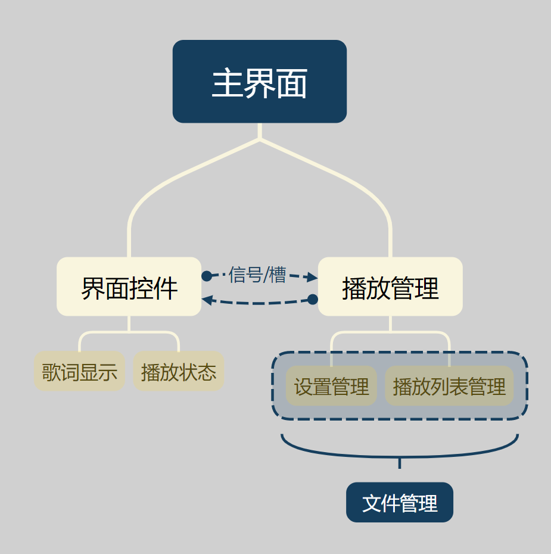
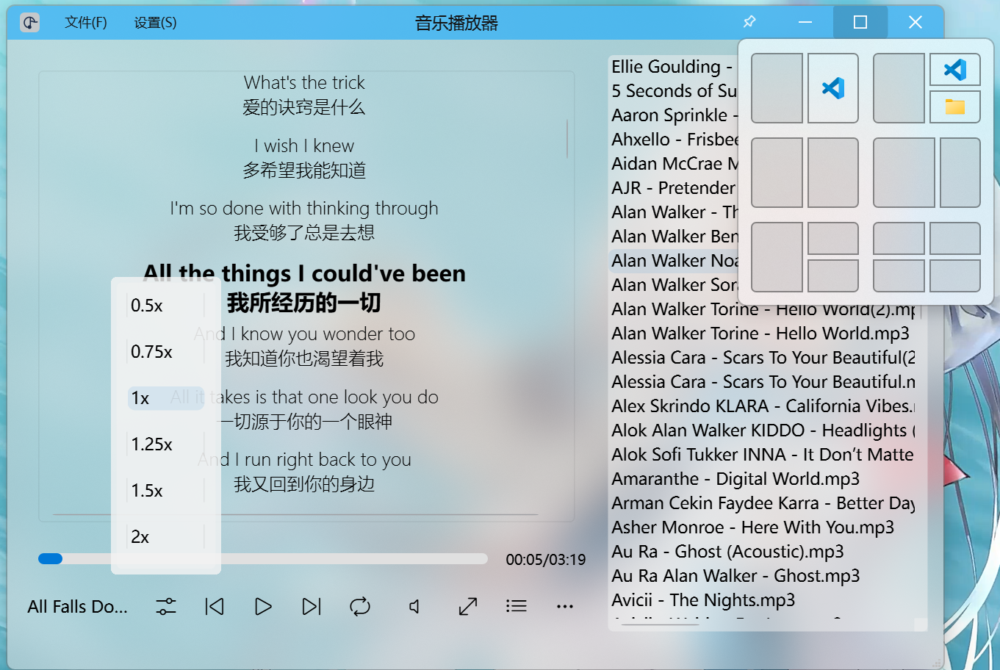

# 音乐播放器项目设计报告

## 1. 需求分析

### 系统功能说明

- **播放功能**：支持播放、暂停、上一曲、下一曲等基本操作。
- **播放列表管理**：支持添加、删除、清空播放列表。
- **文件信息显示**：显示当前播放音乐的详细信息。
- **多语言支持**：支持中文和其他语言切换。
- **跨平台支持**：支持 Windows 和其他主流操作系统。

---

## 2. 架构设计

### 系统总框图



---

## 3. 模块设计

### 1. **主界面模块（MainWidget）**

* 负责主窗口的显示和交互。
* 包括播放控制按钮、播放列表、歌词显示等功能。

### 2. **界面控件模块**

* 提供基础的 UI 组件，如按钮、滑块等。
* 相关类：
  * `PlayPauseButton`
  * `LoopModeSwitcher`
  * `ChangeVolumeButton`
  * `ChangePlaybackSpeedButton`

### 3. **播放管理模块**

* 控制音乐的播放、暂停、上一曲、下一曲等操作。
* 包括播放模式切换（如随机播放、单曲循环）。
* 相关类：
  * `QMediaPlayer`
  * `LoopModeSwitcher`

### 4. **歌词显示模块**

* 显示当前播放音乐的歌词，并支持滚动和高亮。
* 相关类：
  * `DisplayWidget`
  * `LyricsDelegate`

### 5. **播放状态模块**

* 显示当前播放的音乐信息和播放进度。
* 相关类：
  * `MainWidget`

### 6. **设置管理模块**

* 提供用户界面，用于调整字体大小、主题等设置。
* 相关类：
  * `Settings`
  * `ConfigManager`

### 7. **播放列表管理模块**

* 管理音乐文件。
* 相关类：
  * `MusicItem`

### 8. **文件管理模块**

* 负责保存和加载用户设置及播放列表。
* 相关类：
  * `ConfigManager`

---

## 4. 类与函数定义

### MainWidget

```cpp
class MainWidget : public QMainWindow
{
    Q_OBJECT

public:
    MainWidget(QWidget *parent = nullptr);
    ~MainWidget();
    Theme currentTheme{};
    QWK::WidgetWindowAgent *windowAgent;

Q_SIGNALS:
    void themeChanged(Theme t);

protected:
    void resizeEvent(QResizeEvent* event) override;
    void dragEnterEvent(QDragEnterEvent *event) override;
    void dropEvent(QDropEvent *event) override;
    void keyPressEvent(QKeyEvent* event) override;

protected Q_SLOTS:
    void updateMusicList(const QStringList& list);
    void changeMusic(QListWidgetItem* item);
    void on_volumeChanged(int value);
    void on_positionChanged(qint64 value);
private slots:
    void on_pushButton_ShowPlayList_clicked();
    void on_playPauseButton_clicked();
    void on_horizontalSlider_Progress_valueChanged(int value);
    void on_horizontalSlider_Progress_sliderReleased(); 
    void showContextMenu(const QPoint &pos);
    void removeSelectedItem(QListWidgetItem *item);
    void on_loopModeSwitched(LoopModeSwitcher::Mode mode);
    void on_mediaStatusChanged(QMediaPlayer::MediaStatus status);
    void on_enableListWidget();
    void on_pushButton_Previous_clicked();
    void on_pushButton_Next_clicked();
    void on_pushButton_Maximize_clicked();
    void on_pushButton_showFileDetails_clicked();

private:
    void installWindowAgent();
    void loadStyleSheet(Theme theme);
    bool event(QEvent* event) override;
    void paintEvent(QPaintEvent* event) override;
    void updateTimeLabel(qint64 current, qint64 total);
    void updateMusicNameLabel(const QString& musicInfo, int availableWidth);
    Ui::MainWidget *ui;
    bool m_paintTransparentBackground{ true };
    std::shared_ptr<QMediaPlayer> m_mediaPlayer;
    QMediaMetaData m_currentMetaData;
    std::unique_ptr<QTimer> m_playTimer;
    QString m_currentMusicInfo{ QStringLiteral("...") };
    QListWidgetItem* m_playingMusicItem{ nullptr };
    QStringList m_musicList;
    LoopModeSwitcher::Mode m_loopMode = LoopModeSwitcher::Mode::ListLoop;
    std::unique_ptr<QTimer> m_playbackTimer;
    std::unique_ptr<QTimer> m_autoFocusTimer;
    std::vector<QListWidgetItem*> m_playedMusics;
};

```

### MusicItem

```cpp
class MusicItem : public QListWidgetItem
{
	//Q_OBJECT

public:
	QUrl url;
	MusicItem(QListWidget *parent, const QUrl& url);
	~MusicItem();
	QFuture<QMediaMetaData> load(std::shared_ptr<QMediaPlayer>& player);
    QMediaMetaData mediaMetaData() const;
private:
	void updateText();
    QMediaMetaData m_mediaMetaData;
};
```

### Settings

```cpp
class Settings : public BasicWidget
{
    Q_OBJECT

public:
    explicit Settings(QWidget *parent = nullptr);
    ~Settings();
  
private slots:
    void on_spinBox_fontSize_valueChanged(int arg1);

private:
    Ui::Settings* ui;
protected:
    void closeEvent(QCloseEvent* event) override;
};
```

### PlayPauseButton

```cpp
class PlayPauseButton : public QPushButton
{
	Q_OBJECT

public:
	PlayPauseButton(QWidget* parent);
	~PlayPauseButton();
	bool isPlaying() const;
	PlayPauseButton& setIsPlaying(bool isPlaying);

Q_SIGNALS:
	void PlayPauseClicked();
	void IsPlayingChanged(bool);

protected:
	void mousePressEvent(QMouseEvent* event) override {
		if (event->button() == Qt::MouseButton::LeftButton) {
			setIsPlaying(!isPlaying());
			emit PlayPauseClicked();
		}
		QPushButton::mousePressEvent(event);
	}
private:
	void _updateText();
	bool _isPlaying{ false };
};
```

### LoopModeSwitcher

```cpp
class LoopModeSwitcher : public QPushButton {
    Q_OBJECT

public:
    enum Mode {
        ListLoop,
        SingleLoop,
        RandomPlay
    };
    Q_ENUM(Mode)

    explicit LoopModeSwitcher(QWidget* parent = nullptr);

    Mode currentMode() const;

signals:
    void playModeSwitched(Mode mode);

private slots:
    void switchMode();

private:
    Mode mode{ ListLoop };
    void updateIcon();
};
```

### LyricsDelegate

```cpp
class LyricsDelegate : public QStyledItemDelegate
{
    Q_OBJECT

public:
    explicit LyricsDelegate(QObject *parent = nullptr);

    void setHighlightedIndex(int index);
    void setMaxWidth(int width); // New method to set maximum width for lyrics

    void paint(QPainter *painter, const QStyleOptionViewItem &option, const QModelIndex &index) const override;
    QSize sizeHint(const QStyleOptionViewItem &option, const QModelIndex &index) const override;

private:
    int highlightedIndex;
    int maxWidth; // Stores the maximum width for lyrics
};

```

### GlobalConfigs

```cpp
class GlobalConfigs {
public:
	static inline const QString CONFIG_FILE_PATH() {
		return QCoreApplication::applicationDirPath() + QStringLiteral("/config.cfg");
	}
	static inline const QString LOCAL_PLAY_LIST() {
		return QCoreApplication::applicationDirPath() + QStringLiteral("/local.playlist");
	}
	static inline QMap<QString, QVariant> APPLICATION_SETTINGS;
};
```

### DisplayWidget

```cpp
class DisplayWidget : public QWidget
{
    Q_OBJECT

public:
    DisplayWidget(QWidget *parent = nullptr);
    ~DisplayWidget();

    void updateMetaData(const QString &musicFilePath, const QPixmap &albumCover);
    void loadLyrics(const QString &lyricsFilePath);
    QListView* lyricsView; // Replace QTextBrowser with QListView

signals:
    void requestJumpToTimestamp(qint64 timestamp); // Signal to request a jump to a specific timestamp

protected:
    void resizeEvent(QResizeEvent *event) override; // Override resizeEvent

public slots:
    void updateHighlightedLyric(qint64 currentTime); // New method for updating highlighted lyric

private slots:
    void handleLyricDoubleClicked(const QModelIndex &index); // Slot to handle double-click events

private:
    void adjustLyricsMaxWidth(); // Adjust maximum width for lyrics

    QVector<QPair<qint64, QString>> lyricsData; // Stores parsed LRC data
    int currentLyricIndex; // Tracks the currently highlighted lyric
    LyricsDelegate *lyricsDelegate; // Custom delegate for styling lyrics
};
```

### ChangeVolumeWidget && ChangeVolumeButton

```cpp
class ChangeVolumeWidget : public BasicWidget {
	Q_OBJECT

public:
	ChangeVolumeWidget(QWidget* parent);
	~ChangeVolumeWidget();
	QTimer _hideTimer;
	QSlider* slider;

public slots:
	void on_themeChanged(Theme t);

protected:
    void focusOutEvent(QFocusEvent* event) override;
	void paintEvent(QPaintEvent* event) override;
private:
	QVBoxLayout* verticallayout;
	Theme currentTheme{ Dark };
    //QColor m_backgroundColor;
};

class ChangeVolumeButton : public QPushButton
{
	Q_OBJECT

public:
	ChangeVolumeButton(QWidget *parent);
	~ChangeVolumeButton();

    Q_PROPERTY(int volume READ volume WRITE setVolume NOTIFY volumeChanged FINAL)

    int volume() const;
    void setVolume(int newVolume);
	QChar getVolumeIcon() const;
signals:
    void volumeChanged(int i);
protected slots:
	void sliderMoved(int value);
    void updateTooltip(int value);
private:
	void _setVolumeIcon();
	int m_volume{ 100 };
	std::unique_ptr<ChangeVolumeWidget> volumeWidget;
    bool _ignoreNextShow{ false };

protected Q_SLOTS:

	void mousePressEvent(QMouseEvent* event) override;
};
```

### ChangePlaybackSpeedWidget && ChangePlaybackSpeedButton

```cpp
class ChangePlaybackSpeedWidget : public BasicWidget {
    Q_OBJECT

public:
    ChangePlaybackSpeedWidget(QWidget* parent);
    ~ChangePlaybackSpeedWidget();

    QListWidget* speedList;
    QTimer _hideTimer;
    void adjustHeightBasedOnItems(); 
signals:
    void backgroundColorChanged();

protected:
    void focusOutEvent(QFocusEvent* event) override;
    void paintEvent(QPaintEvent* event) override;

private:
    QVBoxLayout* layout;
};

class ChangePlaybackSpeedButton : public QPushButton {
    Q_OBJECT

public:
    ChangePlaybackSpeedButton(QWidget* parent);
    ~ChangePlaybackSpeedButton();
    Q_PROPERTY(double currentSpeed READ currentSpeed WRITE setCurrentSpeed NOTIFY currentSpeedChanged FINAL)
    double currentSpeed() const;
    void setCurrentSpeed(double newCurrentSpeed);

signals:
    void currentSpeedChanged(double speed);

protected:
    void mousePressEvent(QMouseEvent* event) override;

private:
    std::unique_ptr<ChangePlaybackSpeedWidget> speedWidget;
    bool _ignoreNextShow{ false };

    void setupSpeedOptions();
    double m_currentSpeed{ 1.0 };
};

```

### BasicWidget

```cpp
class BasicWidget  : public QWidget
{
	Q_OBJECT

public:
	BasicWidget(QWidget *parent);
	~BasicWidget();
	void paintEvent(QPaintEvent* event) override;
    Q_PROPERTY(QColor backgroundColor READ backgroundColor WRITE setBackgroundColor NOTIFY backgroundColorChanged FINAL)
    Q_PROPERTY(bool enableDWM READ enableDWM WRITE setEnableDWM NOTIFY enableDWMChanged FINAL)
    QColor backgroundColor() const;
    void setBackgroundColor(const QColor &newBackgroundColor);

    bool enableDWM() const;
    void setEnableDWM(bool newEnableDWM);

signals:
    void backgroundColorChanged();
    void enableDWMChanged(bool status);

protected:
	QColor m_backgroundColor;
	bool m_enableDWM{ false };
private:
};
```

---

## 5. 算法说明

### 算法 1：随机播放未播放的音乐

```cpp
// ...
case LoopModeSwitcher::RandomPlay:
{
    std::random_device rd;
    std::mt19937 gen(rd());
    std::uniform_int_distribution<> distrib(0, ui->listWidget_PlayList->count() - 1);
    int peddingMusicRow;
    while (/* generate random number and check music is played or not */) {};
    changeMusic(/* item */);
}
// ...
```

**说明**：通过随机数生成器选择未播放的音乐，避免重复播放。

### 算法 2：异步加载音乐元数据

```cpp
return QtConcurrent::run([this, player]() -> QMediaMetaData {
    static std::atomic<bool> locker = false;
    locker.wait(true);
    locker.store(true);
    // ...
    // Load metadata logic
    locker.store(false);
    locker.notify_one();
    return m_mediaMetaData;
});
```

**说明**：使用 `QtConcurrent::run` 实现异步加载，避免阻塞主线程。

### 算法 3：歌词滚动

```cpp
void DisplayWidget::updateHighlightedLyric(qint64 currentTime) {
    // ...
    int newIndex = -1;
    for (int i = 0; i < lyricsData.size(); ++i) {
        if (currentTime < lyricsData[i].first) break;
        newIndex = i;
    }

    if (newIndex != currentLyricIndex) {
        currentLyricIndex = newIndex;
        lyricsDelegate->setHighlightedIndex(currentLyricIndex); // Update delegate
        lyricsView->update();
        
        lyricsView->scrollTo(lyricsView->model()->index(currentLyricIndex, 0), QAbstractItemView::PositionAtCenter);
    }
    // ...
}
```

**说明**：通过比较当前时间与歌词时间戳，更新高亮歌词并滚动到视图中心。

### 算法 4：歌词解析

```cpp
void DisplayWidget::loadLyrics(const QString &lyricsFilePath) {
    // ...
    QVector<QPair<qint64, QString>> parsedLyrics;
    QFile file(lyricsFilePath);
    if (file.open(QIODevice::ReadOnly | QIODevice::Text)) {
        QTextStream in(&file);
        QRegularExpression regex(R"(\[(\d+):(\d+)\.(\d+)\](.*))"); // Matches [mm:ss.ms]lyric
        while (!in.atEnd()) {
            QString line = in.readLine();
            QRegularExpressionMatch match = regex.match(line);
            if (match.hasMatch()) {
                parsedLyrics.append(/* Extracted time and lyric */);
            }
        }
        file.close();
    }
    // ... 
}
```
**说明**：使用正则表达式解析歌词文件，提取时间戳和歌词文本。
---

## 6. 存在的问题与不足及对策

### 问题与不足

1. **随机算法效率低**：当前随机播放算法在播放列表较大时，可能会因多次查找未播放音乐而导致性能下降。
2. **锁机制存在性能瓶颈**：使用原子变量实现的锁机制可能会在高并发场景下导致线程等待时间过长，影响程序响应速度。
3. **歌词显示功能不完善**：歌词滚动效果不够平滑.
4. **缺乏单元测试覆盖**：部分核心功能（如随机播放、异步加载元数据）缺乏充分的单元测试，可能导致潜在的稳定性问题。
5. **不支持逐字歌词**：目前仅支持逐行歌词显示，未实现逐字歌词的解析和显示。
6. **不支持收藏功能**：当前播放列表不支持收藏功能，用户无法标记喜欢的音乐。
7. **不支持切换播放列表**：当前实现仅支持单一播放列表，无法切换不同的播放列表。
8. **仅支持中文和英文且未提供主动切换开关**：目前仅实现了中文和英文两种语言的翻译，且切换语言的开关未提供给用户，仅能通过删除 `qm`文件切换中英文。

### 对策

1. **优化随机算法**：使用哈希表记录已播放音乐，减少查找时间。
2. **改进锁机制**：使用更高效的锁机制或无锁编程。
3. **改进歌词显示**：
   - 使用更高效的绘制方法，减少重绘次数。
   - 增加歌词滚动速度调节功能。
4. **增加单元测试**：为核心功能编写单元测试，确保代码的稳定性和可靠性。
5. **支持逐字歌词**：增加对逐字歌词的解析和显示功能。
6. **添加收藏功能**：在播放列表中添加收藏功能，允许用户标记喜欢的音乐。
7. **支持切换播放列表**：实现播放列表的切换功能，允许用户在不同的播放列表之间切换。
8. **增加语言切换功能**：提供用户界面，允许用户主动选择语言，避免手动删除 `qm`文件。

---

## 7. 使用说明

1. 添加音频到播放列表：
    - 将文件直接拖进播放器窗口即可在添加到播放列表中。
    - 将文件拖放到可执行文件上（即传入文件所在路径的启动参数）即可在添加到播放列表中并自动播放传入的第一个音频文件。
    - 可在程序菜单中批量添加音频文件，支持多选。
    - 支持多个文件拖入，自动筛选音频文件放入播放列表，可过滤非音频文件。
    - 支持通过右键菜单删除播放列表内的音频文件，支持通过键盘上的`Delete`键删除。
    - 支持通过右键菜单清空播放列表。
2. 播放音频：
    - 双击播放列表中的音频文件名即可开始播放。
    - 点击前一首或后一首按钮可切换到上一首或下一首音频。
        - 若当前播放模式为随机播放两个按钮行为一致，均为随机选择非当前音频进行播放。
        - 若当前模式为单曲循环或列表循环则播放当前音频的下一首或上一首。
    - 播放速度调节：
        - 提供多种常见倍速选项供用户选择。
    - 播放进度和状态调节：
        - 播放进度条可拖动，拖动后会自动更新当前播放时间。
        - 支持按空格键暂停或继续播放。
        - 支持按左右箭头按键调整播放进度。
        - 支持双击歌词跳转至歌词所在时间。
    - 支持音频文件元数据的解析和显示。
3. 歌词显示：
    - 支持解析`.lrc`格式歌词文件，歌词文件名需与音频文件名一致。
    - 歌词支持自动滚动，当前歌词加粗显示，字号加大。
4. 部分设置记忆：
    - 支持调整和记忆歌词字体大小。
    - 支持记忆上次音量。

### 截图

#### 主界面


#### 播放中 && 音频文件详细信息


#### 设置界面


#### 播放速度调节 && 支持Windows 11原生分屏功能


#### 隐藏播放列表 && 置于顶层

---


## 8. 程序源码

### BasicWidget.h
```cpp
#pragma once

#include <QWidget>
#include "includeFiles.h"


class BasicWidget  : public QWidget
{
	Q_OBJECT

public:
	BasicWidget(QWidget *parent);
	~BasicWidget();
	void paintEvent(QPaintEvent* event) override;
    Q_PROPERTY(QColor backgroundColor READ backgroundColor WRITE setBackgroundColor NOTIFY backgroundColorChanged FINAL)
    Q_PROPERTY(bool enableDWM READ enableDWM WRITE setEnableDWM NOTIFY enableDWMChanged FINAL)
    QColor backgroundColor() const;
    void setBackgroundColor(const QColor &newBackgroundColor);

    bool enableDWM() const;
    void setEnableDWM(bool newEnableDWM);

signals:
    void backgroundColorChanged();
    void enableDWMChanged(bool status);

protected:
	QColor m_backgroundColor;
	bool m_enableDWM{ false };
private:
};

#ifdef _WIN32

typedef enum _WINDOWCOMPOSITIONATTRIB
{
	CA_UNDEFINED = 0,
	WCA_NCRENDERING_ENABLED = 1,
	WCA_NCRENDERING_POLICY = 2,
	WCA_TRANSITIONS_FORCEDISABLED = 3,
	WCA_ALLOW_NCPAINT = 4,
	WCA_CAPTION_BUTTON_BOUNDS = 5,
	WCA_NONCLIENT_RTL_LAYOUT = 6,
	WCA_FORCE_ICONIC_REPRESENTATION = 7,
	WCA_EXTENDED_FRAME_BOUNDS = 8,
	WCA_HAS_ICONIC_BITMAP = 9,
	WCA_THEME_ATTRIBUTES = 10,
	WCA_NCRENDERING_EXILED = 11,
	WCA_NCADORNMENTINFO = 12,
	WCA_EXCLUDED_FROM_LIVEPREVIEW = 13,
	WCA_VIDEO_OVERLAY_ACTIVE = 14,
	WCA_FORCE_ACTIVEWINDOW_APPEARANCE = 15,
	WCA_DISALLOW_PEEK = 16,
	WCA_CLOAK = 17,
	WCA_CLOAKED = 18,
	WCA_ACCENT_POLICY = 19,//
	WCA_FREEZE_REPRESENTATION = 20,
	WCA_EVER_UNCLOAKED = 21,
	WCA_VISUAL_OWNER = 22,
	WCA_LAST = 23
} WINDOWCOMPOSITIONATTRIB;

typedef struct _WINDOWCOMPOSITIONATTRIBDATA
{
	WINDOWCOMPOSITIONATTRIB Attrib;
	PVOID pvData;
	SIZE_T cbData;
} WINDOWCOMPOSITIONATTRIBDATA;

typedef enum _ACCENT_STATE
{
	ACCENT_DISABLED = 0,
	ACCENT_ENABLE_GRADIENT = 1,
	ACCENT_ENABLE_TRANSPARENTGRADIENT = 2,
	ACCENT_ENABLE_BLURBEHIND = 3,
	ACCENT_INVALID_STATE = 4
} ACCENT_STATE;

typedef struct _ACCENT_POLICY
{
	ACCENT_STATE AccentState;
	DWORD AccentFlags;
	DWORD GradientColor;
	DWORD AnimationId;
} ACCENT_POLICY;

WINUSERAPI BOOL WINAPI GetWindowCompositionAttribute(
	_In_ HWND hWnd,
	_Inout_ WINDOWCOMPOSITIONATTRIBDATA* pAttrData);

typedef BOOL(WINAPI* pfnGetWindowCompositionAttribute)(HWND, WINDOWCOMPOSITIONATTRIBDATA*);

WINUSERAPI BOOL WINAPI SetWindowCompositionAttribute(
	_In_ HWND hWnd,
	_Inout_ WINDOWCOMPOSITIONATTRIBDATA* pAttrData);

typedef BOOL(WINAPI* pfnSetWindowCompositionAttribute)(HWND, WINDOWCOMPOSITIONATTRIBDATA*);

#endif	// _WIN32
```

### BasicWidget.cpp
```cpp
#include "BasicWidget.h"


BasicWidget::BasicWidget(QWidget *parent)
	: QWidget(parent)
{
	//setWindowFlags(Qt::Window | Qt::FramelessWindowHint | Qt::WindowSystemMenuHint | Qt::WindowMinimizeButtonHint | Qt::WindowMaximizeButtonHint);
	//setWindowFlags( Qt::FramelessWindowHint);
	setAttribute(Qt::WA_TranslucentBackground);//背景半透明属性设置   //窗口透明 
	setWindowFlags(Qt::FramelessWindowHint | Qt::Dialog);

}

BasicWidget::~BasicWidget()
{}

void BasicWidget::paintEvent(QPaintEvent * event)
{
	QPainter painter(this);
	painter.fillRect(this->rect(), m_backgroundColor);
}

QColor BasicWidget::backgroundColor() const
{
    return m_backgroundColor;
}

void BasicWidget::setBackgroundColor(const QColor &newBackgroundColor)
{
    if (m_backgroundColor == newBackgroundColor)
        return;
    m_backgroundColor = newBackgroundColor;
    emit backgroundColorChanged();
}

void BasicWidget::setEnableDWM(bool newEnableDWM)
{
	if (m_enableDWM == newEnableDWM)
		return;
	m_enableDWM = newEnableDWM;
	emit enableDWMChanged(newEnableDWM);
#ifdef _WIN32
	HWND hWnd = HWND(this->winId());
	HMODULE hUser = GetModuleHandle(TEXT("user32.dll"));
	if (hUser)
	{
		pfnSetWindowCompositionAttribute setWindowCompositionAttribute = (pfnSetWindowCompositionAttribute)GetProcAddress(hUser, "SetWindowCompositionAttribute");
		if (setWindowCompositionAttribute)
		{
			ACCENT_POLICY accent;
			if (enableDWM()) {
				accent = { ACCENT_ENABLE_BLURBEHIND, 0, 0, 0 };
			}
			else {
				accent = { ACCENT_DISABLED, 0, 0, 0 };

			}
			WINDOWCOMPOSITIONATTRIBDATA data;
			data.Attrib = WCA_ACCENT_POLICY;
			data.pvData = &accent;
			data.cbData = sizeof(accent);
			setWindowCompositionAttribute(hWnd, &data);
		}
	}
#endif // _WIN32
}

bool BasicWidget::enableDWM() const
{
    return m_enableDWM;
}
```

### ChangePlaybackSpeedButton.h
```cpp
#pragma once

#include "includeFiles.h"
#include "BasicWidget.h"

class ChangePlaybackSpeedWidget : public BasicWidget {
    Q_OBJECT

public:
    ChangePlaybackSpeedWidget(QWidget* parent);
    ~ChangePlaybackSpeedWidget();

    QListWidget* speedList;
    QTimer _hideTimer;
    void adjustHeightBasedOnItems(); 
signals:
    void backgroundColorChanged();

protected:
    void focusOutEvent(QFocusEvent* event) override;
    void paintEvent(QPaintEvent* event) override;

private:
    QVBoxLayout* layout;
};

class ChangePlaybackSpeedButton : public QPushButton {
    Q_OBJECT

public:
    ChangePlaybackSpeedButton(QWidget* parent);
    ~ChangePlaybackSpeedButton();
    Q_PROPERTY(double currentSpeed READ currentSpeed WRITE setCurrentSpeed NOTIFY currentSpeedChanged FINAL)
    double currentSpeed() const;
    void setCurrentSpeed(double newCurrentSpeed);

signals:
    void currentSpeedChanged(double speed);

protected:
    void mousePressEvent(QMouseEvent* event) override;

private:
    std::unique_ptr<ChangePlaybackSpeedWidget> speedWidget;
    bool _ignoreNextShow{ false };

    void setupSpeedOptions();
    double m_currentSpeed{ 1.0 };
};
```

### ChangePlaybackSpeedButton.cpp
```cpp
#include "ChangePlaybackSpeedButton.h"
#include <QPainter>
#include <QPainterPath>
#include <QStyleOptionViewItem>

ChangePlaybackSpeedWidget::ChangePlaybackSpeedWidget(QWidget* parent)
    : BasicWidget(parent) {
    this->hide();
    this->setWindowFlags(Qt::Window | Qt::FramelessWindowHint);
	this->setObjectName("playbackSpeedWidget");
    speedList = new QListWidget(this);
    speedList->setSpacing(10); // Increase spacing between items
    layout = new QVBoxLayout(this);
    layout->setContentsMargins(0, 0, 0, 0);
    layout->addWidget(speedList);

    adjustHeightBasedOnItems();
}

ChangePlaybackSpeedWidget::~ChangePlaybackSpeedWidget() {
    delete speedList;
    delete layout;
}

void ChangePlaybackSpeedWidget::focusOutEvent(QFocusEvent* event) {
    this->hide();
    _hideTimer.setInterval(50);
    _hideTimer.setSingleShot(true);
    _hideTimer.start();
    BasicWidget::focusOutEvent(event);
}

void ChangePlaybackSpeedWidget::paintEvent(QPaintEvent* event) {
    QPainter painter(this);
    QPainterPath path;
    path.addRoundedRect(rect(), 5, 5);
    painter.fillPath(path, QBrush(m_backgroundColor));
    painter.end();
}


void ChangePlaybackSpeedWidget::adjustHeightBasedOnItems() {
    int itemCount = speedList->count();
    int itemHeight = 40; // Approximate height of each item including spacing
    int totalHeight = itemCount * itemHeight + 30; // Add some padding
    this->setFixedHeight(totalHeight);
    this->setFixedWidth(100);
}

ChangePlaybackSpeedButton::ChangePlaybackSpeedButton(QWidget* parent)
    : QPushButton(parent) {
    speedWidget = std::make_unique<ChangePlaybackSpeedWidget>(this);
	connect(speedWidget->speedList, &QListWidget::itemClicked, [this](QListWidgetItem* item) {
		if (item) {
			double speed = item->data(Qt::UserRole).toDouble();
			setCurrentSpeed(speed);
			speedWidget->hide();
		}
		});
    setupSpeedOptions();
}

ChangePlaybackSpeedButton::~ChangePlaybackSpeedButton() {}

void ChangePlaybackSpeedButton::mousePressEvent(QMouseEvent* event) {
    if (speedWidget->isHidden()) {
        if (speedWidget->_hideTimer.remainingTime() > 0 && _ignoreNextShow)
        {
            _ignoreNextShow = false;
            return;
        }
        QPoint globalPos = this->mapToGlobal(QPoint(0, 0));
        QRect buttonRect = this->geometry();
        int x = globalPos.x() + (buttonRect.width() - speedWidget->width()) / 2;
        int y = globalPos.y() - speedWidget->height() - 10;
        speedWidget->move(x, y);
        speedWidget->show();
        speedWidget->setFocus();
        _ignoreNextShow = true;
    } else {
        speedWidget->hide();
    }
}

void ChangePlaybackSpeedButton::setupSpeedOptions() {
    QList<double> speeds = {0.5, 0.75, 1.0, 1.25, 1.5, 2.0};
    for (double speed : speeds) {
        QListWidgetItem* item = new QListWidgetItem(QString::number(speed) + "x", speedWidget->speedList);
        item->setData(Qt::UserRole, speed);
        speedWidget->speedList->addItem(item);
    }
	speedWidget->speedList->setCurrentRow((int)speeds.indexOf(1.0, 0));
    speedWidget->adjustHeightBasedOnItems();
}

double ChangePlaybackSpeedButton::currentSpeed() const
{
    return m_currentSpeed;
}

void ChangePlaybackSpeedButton::setCurrentSpeed(double newCurrentSpeed)
{
    if (qFuzzyCompare(m_currentSpeed, newCurrentSpeed))
        return;
    m_currentSpeed = newCurrentSpeed;
    emit currentSpeedChanged(newCurrentSpeed);
}
```

### ChangeVolumeButton.h
```cpp
#pragma once

#include <QPushButton>
#include "includeFiles.h"
#include "BasicWidget.h"
#include "widget.h"

class ChangeVolumeWidget : public BasicWidget {
	Q_OBJECT

public:
	ChangeVolumeWidget(QWidget* parent);
	~ChangeVolumeWidget();
	QTimer _hideTimer;
	QSlider* slider;
    //Q_PROPERTY(QColor backgroundColor READ backgroundColor WRITE setBackgroundColor NOTIFY backgroundColorChanged FINAL)
    //QColor backgroundColor() const;
    //void setBackgroundColor(const QColor &newBackgroundColor);

public slots:
	void on_themeChanged(Theme t);

//signals:
//    void backgroundColorChanged();

protected:
    void focusOutEvent(QFocusEvent* event) override;
	void paintEvent(QPaintEvent* event) override;
private:
	QVBoxLayout* verticallayout;
	Theme currentTheme{ Dark };
    //QColor m_backgroundColor;
};

class ChangeVolumeButton : public QPushButton
{
	Q_OBJECT

public:
	ChangeVolumeButton(QWidget *parent);
	~ChangeVolumeButton();

    Q_PROPERTY(int volume READ volume WRITE setVolume NOTIFY volumeChanged FINAL)

    int volume() const;
    void setVolume(int newVolume);
	QChar getVolumeIcon() const;
signals:
    void volumeChanged(int i);
protected slots:
	void sliderMoved(int value);
    void updateTooltip(int value);
private:
	void _setVolumeIcon();
	int m_volume{ 100 };
	std::unique_ptr<ChangeVolumeWidget> volumeWidget;
    bool _ignoreNextShow{ false };

protected Q_SLOTS:

	void mousePressEvent(QMouseEvent* event) override;
};

```

### ChangeVolumeButton.cpp
```cpp
#include "ChangeVolumeButton.h"

ChangeVolumeButton::ChangeVolumeButton(QWidget *parent)
	: QPushButton(parent)
{
    volumeWidget = std::make_unique<ChangeVolumeWidget>(dynamic_cast<QWidget*>(this));
    setFont(Icons::Font);
    volumeWidget->setGeometry(QRect(0, 0, 100, 10)); 
    connect(volumeWidget->slider, SIGNAL(valueChanged(int)), this, SLOT(sliderMoved(int)));
    connect(volumeWidget->slider, SIGNAL(valueChanged(int)), this, SLOT(updateTooltip(int)));
    _setVolumeIcon();
}

ChangeVolumeButton::~ChangeVolumeButton()
{
}

int ChangeVolumeButton::volume() const
{
    return m_volume;
}

void ChangeVolumeButton::setVolume(int newVolume)
{
    if (m_volume == newVolume)
        return;
    m_volume = newVolume;
    _setVolumeIcon();
    emit volumeChanged(m_volume);
}
void ChangeVolumeButton::sliderMoved(int value) {
    setVolume(value);
}

void ChangeVolumeButton::updateTooltip(int value) {
    // Calculate the position of the slider handle
    int sliderPosition = volumeWidget->slider->style()->sliderPositionFromValue(volumeWidget->slider->minimum(), volumeWidget->slider->maximum(), value, volumeWidget->slider->width());
    QPoint handleGlobalPos = volumeWidget->slider->mapToGlobal(QPoint(sliderPosition, 0));
    
    // Calculate the center position above the volumeWidget
    QPoint widgetGlobalPos = volumeWidget->mapToGlobal(volumeWidget->rect().center());
    QPoint tooltipPos(widgetGlobalPos.x(), widgetGlobalPos.y() - 40); // Adjust the y-coordinate to display above the volumeWidget
    
    QToolTip::showText(tooltipPos, QString::number(value), volumeWidget->slider);
}

QChar ChangeVolumeButton::getVolumeIcon() const
{
    if (volume() >= 75)
    {
        return QChar(Icons::Volume3);
    }
    else if (volume() >= 50)
    {
        return QChar(Icons::Volume2);
    }
    else if (volume() >= 25)
    {
        return QChar(Icons::Volume1);
    }
    else if (volume() > 0)
    {
        return QChar(Icons::Volume0);
    }
    else {
        return QChar(Icons::Mute);
    }

}

void ChangeVolumeButton::_setVolumeIcon()
{
    this->setText(getVolumeIcon());
}

void ChangeVolumeButton::mousePressEvent(QMouseEvent* event) {
    if (volumeWidget->isHidden()) {
        if (volumeWidget->_hideTimer.remainingTime() > 0 && _ignoreNextShow)
        {
            _ignoreNextShow = false;
            return;
        }
        // 获取按钮在屏幕上的全局位置
        QPoint globalPos = this->mapToGlobal(QPoint(0, 0));
        // 获取按钮的位置和大小
        QRect buttonRect = this->geometry();
        // 计算 volumeWidget 的新位置，使其显示在按钮的上方并且中心对齐
        int x = globalPos.x() + (buttonRect.width() - volumeWidget->width()) / 2;
        int y = globalPos.y() - volumeWidget->height() - 10;
        volumeWidget->move(x, y);
        volumeWidget->show();
        volumeWidget->setFocus();
        volumeWidget->slider->setValue(volume());
        _ignoreNextShow = true; // Ignore the next focus out event
    }
    else {
        volumeWidget->hide();
    }
}

ChangeVolumeWidget::ChangeVolumeWidget(QWidget* parent)
    : BasicWidget(parent)
{
    this->hide(); 
    this->setWindowFlags(Qt::Window | Qt::FramelessWindowHint );
    this->setFixedHeight(30); 
    this->setObjectName(QStringLiteral("volumeWidget"));
    slider = new QSlider(this);
    slider->setOrientation(Qt::Horizontal);
    slider->setSizePolicy(QSizePolicy::Expanding, QSizePolicy::Fixed); // Adjust size policy
    slider->setObjectName(QStringLiteral("VolumeSlider"));
    slider->setMaximum(100);
    verticallayout = new QVBoxLayout(this);
    verticallayout->setContentsMargins(0, 0, 0, 0); // Remove margins
    verticallayout->addWidget(slider);
}

ChangeVolumeWidget::~ChangeVolumeWidget()
{
    delete slider;
    delete verticallayout;
}

void ChangeVolumeWidget::focusOutEvent(QFocusEvent* event)
{
    if (event->reason() == Qt::FocusReason::MouseFocusReason && slider->underMouse()) {
        BasicWidget::focusOutEvent(event);
        setFocus();
        return; 
    }
    this->hide(); 
    _hideTimer.setInterval(50);
    _hideTimer.setSingleShot(true);
    _hideTimer.start();
    BasicWidget::focusOutEvent(event); 
}

void ChangeVolumeWidget::paintEvent(QPaintEvent* event)
{
    QPainter painter(this);
    QPainterPath path;
    path.addRoundedRect(rect(), 5, 5);
    painter.fillPath(path, QBrush(m_backgroundColor));
    painter.end();
}

void ChangeVolumeWidget::on_themeChanged(Theme t) {
    currentTheme = t;
    update();
}
//QColor ChangeVolumeWidget::backgroundColor() const
//{
//    return m_backgroundColor;
//}
//
//void ChangeVolumeWidget::setBackgroundColor(const QColor &newBackgroundColor)
//{
//    if (m_backgroundColor == newBackgroundColor)
//        return;
//    m_backgroundColor = newBackgroundColor;
//    emit backgroundColorChanged();
//}
```

### ConfigManager.h
```cpp
#pragma once

#include "includeFiles.h"

class ConfigManager
{
private:

public:
	//Asynchronous save and load functions
	static QFuture<bool> SaveLoadedMusicList(const QStringList& list);
	static QFuture<bool> SaveSettings(const QString& settingsPath, const QMap<QString, QVariant>& settings);
	
	static QFuture<QStringList> LoadMusicList(const QString& listPath);
	static QFuture<ApplicationSettings> LoadSettings(const QString& settingsPath);
};
```

### ConfigManager.cpp
```cpp
// 学校: 南京航空航天大学
// 学号: 082420122
// 姓名: 周奕轩
// 项目: 2025 C++程序设计课程设计

#include "ConfigManager.h"
#include <QFile>
#include <QTextStream>

// 姓名: 周奕轩
// Asynchronous save function implementation
QFuture<bool> ConfigManager::SaveLoadedMusicList(const QStringList& list) {
	return QtConcurrent::run([&](const QStringList& list){
		static std::atomic_bool locker{ false };
		locker.wait(true);
		QFile file{ GlobalConfigs::LOCAL_PLAY_LIST()};
		if (!file.open(QIODevice::WriteOnly | QIODevice::Text)) {
			locker.store(false);
			locker.notify_one(); 
			return false;
		}

		QTextStream out(&file);
		for (const auto& item : list) {
			out << item << '\n';
		}
		file.close();
		locker.store(false);
		locker.notify_one();
		return true;
	}, list);
}

// 学校: 南京航空航天大学
// Asynchronous load function implementation
QFuture<QStringList> ConfigManager::LoadMusicList(const QString& listPath) {
	return QtConcurrent::run([&, listPath](){
		static std::atomic_bool locker{ false };
		locker.wait(true);
		QStringList list;
		QFile file{ listPath };
		if (!file.open(QIODevice::ReadOnly | QIODevice::Text)) {
			locker.store(false);
			locker.notify_one();
			return list; // Return empty list if file cannot be opened
		}

		QTextStream in(&file);
		while (!in.atEnd()) {
			list.append(in.readLine());
		}
		file.close();
		locker.store(false);
		locker.notify_one();
		return list;
	});
}

// 项目: 2025 C++程序设计课程设计
QFuture<bool> ConfigManager::SaveSettings(const QString& settingsPath, const QMap<QString, QVariant>& settings)
{
	return QtConcurrent::run([&, settingsPath, settings]() {
		QFile file{ settingsPath };
		if (!file.open(QIODevice::WriteOnly | QIODevice::Text)) {
			return false;
		}
		QTextStream out(&file);
		for (auto it = settings.constBegin(); it != settings.constEnd(); ++it) {
			out << it.key() << '=' << it.value().toString() << '\n';
		}
		file.close();
		return true;
	});
}

// 学号: 082420122
QFuture<ApplicationSettings> ConfigManager::LoadSettings(const QString& settingsPath)
{
	return QtConcurrent::run([&, settingsPath]() {
		QMap<QString, QVariant> settings;
		QFile file{ settingsPath };
		if (!file.open(QIODevice::ReadOnly | QIODevice::Text)) {
			return settings; // Return empty map if file cannot be opened
		}
		QTextStream in(&file);
		while (!in.atEnd()) {
			QString line = in.readLine();
			QStringList parts = line.split('=');
			if (parts.size() == 2) {
				settings.insert(parts[0], parts[1]);
			}
		}
		file.close();
		return settings;
	});
}
```

### DisplayWidget.h
```cpp
#pragma once

#include "includeFiles.h"
#include "LyricsDelegate.h" // Include the custom delegate header
#include <QVector>
#include <QPair>

class DisplayWidget : public QWidget
{
    Q_OBJECT

public:
    DisplayWidget(QWidget *parent = nullptr);
    ~DisplayWidget();

    void updateMetaData(const QString &musicFilePath, const QPixmap &albumCover);
    void loadLyrics(const QString &lyricsFilePath);
    QListView* lyricsView; // Replace QTextBrowser with QListView

signals:
    void requestJumpToTimestamp(qint64 timestamp); // Signal to request a jump to a specific timestamp

protected:
    void resizeEvent(QResizeEvent *event) override; // Override resizeEvent

public slots:
    void updateHighlightedLyric(qint64 currentTime); // New method for updating highlighted lyric

private slots:
    void handleLyricDoubleClicked(const QModelIndex &index); // Slot to handle double-click events

private:
    void adjustLyricsMaxWidth(); // Adjust maximum width for lyrics

    QVector<QPair<qint64, QString>> lyricsData; // Stores parsed LRC data
    int currentLyricIndex; // Tracks the currently highlighted lyric
    LyricsDelegate *lyricsDelegate; // Custom delegate for styling lyrics
};
```

### DisplayWidget.cpp
```cpp
#include "DisplayWidget.h"
#include "LyricsDelegate.h"

DisplayWidget::DisplayWidget(QWidget *parent)
    : QWidget(parent), currentLyricIndex(-1)
{
    QHBoxLayout *mainLayout = new QHBoxLayout(this);
    QVBoxLayout *rightLayout = new QVBoxLayout();

    lyricsView = new QListView(this); // Initialize QListView
    lyricsView->setVerticalScrollMode(QAbstractItemView::ScrollPerPixel);
    lyricsView->setEditTriggers(QAbstractItemView::NoEditTriggers);

    lyricsDelegate = new LyricsDelegate(this); // Initialize custom delegate
    lyricsView->setItemDelegate(lyricsDelegate);
	lyricsView->setObjectName("lyricsView");
    rightLayout->addWidget(lyricsView);
    mainLayout->addLayout(rightLayout);

    QTimer* tmp = new QTimer(this);
	tmp->singleShot(10, [this, tmp]() {
		// Set the maximum width for lyrics
		adjustLyricsMaxWidth();
        tmp->deleteLater();
		});

    connect(lyricsView, SIGNAL(doubleClicked(QModelIndex)), this, SLOT(handleLyricDoubleClicked(QModelIndex)));
}

void DisplayWidget::resizeEvent(QResizeEvent *event)
{
    QWidget::resizeEvent(event); // Call base class implementation
    adjustLyricsMaxWidth(); // Adjust maximum width for lyrics
}

DisplayWidget::~DisplayWidget()
{
}

void DisplayWidget::updateMetaData(const QString &musicFilePath, const QPixmap &albumCover)
{
    // Load lyrics
    QString lyricsFilePath = musicFilePath;
    lyricsFilePath.replace(QRegularExpression("\\.\\w+$"), ".lrc"); // Use QRegularExpression instead of QRegExp
    loadLyrics(lyricsFilePath);
}

void DisplayWidget::loadLyrics(const QString &lyricsFilePath)
{
    // Create a QFutureWatcher to monitor the asynchronous task
    QFutureWatcher<QVector<QPair<qint64, QString>>> *watcher = new QFutureWatcher<QVector<QPair<qint64, QString>>>(this);

    // Connect the finished signal to update the UI
    connect(watcher, &QFutureWatcher<QVector<QPair<qint64, QString>>>::finished, this, [this, watcher]() {
        lyricsData = watcher->result(); // Retrieve the parsed lyrics data

        if (lyricsData.isEmpty()) {
            QStringListModel *model = new QStringListModel(this);
            model->setStringList({"Lyrics not found."});
            lyricsView->setModel(model);
        } else {
            QStringList lyricsList;
            for (const auto &lyric : lyricsData) {
                lyricsList.append(lyric.second);
            }
            QStringListModel *model = new QStringListModel(this);
            model->setStringList(lyricsList);
            lyricsView->setModel(model);
        }

        watcher->deleteLater(); // Clean up the watcher
    });

    // Run the parsing logic asynchronously
    QFuture<QVector<QPair<qint64, QString>>> future = QtConcurrent::run([lyricsFilePath]() {
        QVector<QPair<qint64, QString>> parsedLyrics;
        QFile file(lyricsFilePath);
        if (file.open(QIODevice::ReadOnly | QIODevice::Text)) {
            QTextStream in(&file);
            QRegularExpression regex(R"(\[(\d+):(\d+)\.(\d+)\](.*))"); // Matches [mm:ss.ms]lyric
            while (!in.atEnd()) {
                QString line = in.readLine();
                QRegularExpressionMatch match = regex.match(line);
                if (match.hasMatch()) {
                    qint64 minutes = match.captured(1).toInt();
                    qint64 seconds = match.captured(2).toInt();
                    qint64 milliseconds = match.captured(3).toInt();
                    qint64 timestamp = (minutes * 60 + seconds) * 1000 + milliseconds;
                    QString lyric = match.captured(4).trimmed();
                    lyric.replace("  ", "\n");
                    lyric.replace("//", "");
                    parsedLyrics.append(qMakePair(timestamp, lyric));
                }
            }
            file.close();
        }
        return parsedLyrics;
    });

    // Set the future to the watcher
    watcher->setFuture(future);
}

void DisplayWidget::updateHighlightedLyric(qint64 currentTime)
{
    if (lyricsData.isEmpty()) return;

    int newIndex = -1;
    for (int i = 0; i < lyricsData.size(); ++i) {
        if (currentTime < lyricsData[i].first) break;
        newIndex = i;
    }

    if (newIndex != currentLyricIndex) {
        currentLyricIndex = newIndex;
        lyricsDelegate->setHighlightedIndex(currentLyricIndex); // Update delegate
        lyricsView->update();
        // Fix: Provide both row and column arguments to index()
        lyricsView->scrollTo(lyricsView->model()->index(currentLyricIndex, 0), QAbstractItemView::PositionAtCenter);
    }
}

void DisplayWidget::adjustLyricsMaxWidth()
{
    if (!lyricsView) return;

    int maxWidth = lyricsView->viewport()->width(); // Set max width to match lyricsView's width
    lyricsDelegate->setMaxWidth(maxWidth); // Update delegate with new max width
    lyricsView->setModel(lyricsView->model());
    lyricsView->update();
}

void DisplayWidget::handleLyricDoubleClicked(const QModelIndex &index)
{
    if (!lyricsData.isEmpty() && index.isValid() && index.row() < lyricsData.size()) {
        qint64 timestamp = lyricsData[index.row()].first;
        emit requestJumpToTimestamp(timestamp); // Emit the jump signal with the timestamp
    }
}
```

### includeFiles.h
```cpp
#pragma once

//DEBUG
#ifdef _DEBUG
//#undef _WIN32
#define DEBUG
#endif // 


#ifdef _WIN32
#include <windows.h>
#include <dwmapi.h>
#pragma comment(lib, "dwmapi.lib")	
#define NOMINMAX
#endif	// _WIN32

//CPP standard headers
#include <memory>
#include <atomic>
#include <random>

//Qt headers
#include <QtCore/QDebug>
#include <QtCore/QFile>
#include <QtCore/QTime>
#include <QtCore/QTimer>
#include <QtGui/QPainter>
#include <QtGui/QWindow>
#include <QtWidgets/qslider.h>
#include <QtWidgets/QApplication>
#include <QtWidgets/QStyle>
#include <QtWidgets/QPushButton>
#include <QtWidgets/qboxlayout.h>
#include <QtWidgets/qtooltip.h>
#include <QFuture>
#include <QtConcurrent/qtconcurrentrun.h>
#include <QtWidgets/qlistwidget.h>
#include <QListWidgetItem>
#include <QLabel>
#include <QPropertyAnimation>
#include <QMimeData>
#include <QFileInfo>
#include <QVBoxLayout>
#include <QTextStream>
#include <QTransform>
#include <QTextBrowser>
#include <QRegExp>
#include <QSvgRenderer>
#include <QMenu>
#include <QAction>
#include <QtConcurrent/QtConcurrent>
#include <QFutureWatcher>

#include <qstringlistmodel.h>
#include <qpainterpath.h>
#include <qwidget.h>
#include <qpainter.h>
#include <qmainwindow.h>
#include <qlabel.h>
#include <qmenubar.h>
#include <qmenu.h>
#include <qtoolbar.h>
#include <qaction.h>
#include <qfiledialog.h>
#include <qmessagebox.h>
#include <qtimer.h>
#include <qevent.h>
#include <QtMultimedia/qmediaplayer.h>
#include <qthread.h>
#include <qurl.h>
#include <qmediametadata.h>
#include <qaudiooutput.h>
#include <qsettings.h>
#if QT_VERSION >= QT_VERSION_CHECK(6, 0, 0)
#  include <QtGui/QActionGroup>
#else
#  include <QtWidgets/QActionGroup>
#endif

//QWindowKit headers
#include <QWKWidgets/widgetwindowagent.h>
#include "../libs/QWindowKit/src/widgets/widgetwindowagent.h"
#include <widgetframe/windowbar.h>
#include <widgetframe/windowbutton.h>
#include <QWKWidgets/qwkwidgetsglobal.h>
#include <QWKCore/qwkglobal.h>
#include <QWKCore/windowagentbase.h>

enum Theme {
	Dark,
	Light,
};

class Utils {
public:
	static inline QString QTimeToQString(const QTime& time) {
		return (time < QTime(1, 0, 0, 0)) ? time.toString("mm:ss") : time.toString("hh:mm:ss");
	}
	static inline QPixmap loadSvgAsPixmap(const QString& resourcePath, const QSize& size) {
		QSvgRenderer svgRenderer(resourcePath);
		QPixmap pixmap(size);
		pixmap.fill(Qt::transparent); // 确保背景透明
		QPainter painter(&pixmap);
		svgRenderer.render(&painter);
		return pixmap;
	}
};

class GlobalConfigs {
public:
	static inline const QString CONFIG_FILE_PATH() {
		return QCoreApplication::applicationDirPath() + QStringLiteral("/config.cfg");
	}
	static inline const QString LOCAL_PLAY_LIST() {
		return QCoreApplication::applicationDirPath() + QStringLiteral("/local.playlist");
	}
	static inline QMap<QString, QVariant> APPLICATION_SETTINGS;
};

//Icons in Segoe Fluent Icons font
//Needs set font to "Segoe Fluent Icons"
namespace Icons {
	const auto Font = QFont(QStringLiteral("Segoe Fluent Icons"));
	enum Icons {
		Play = 0xe768,
		Pause = 0xe769,
		Cancel = 0xe711,
		Refresh = 0xe72c,
		EndPoint = 0xe81b,
		MapLayers = 0xe81e,
		Recent = 0xe823,
		ChromeBack = 0xe830,
		Previous = 0xe892,
		Next = 0xe893,
		Clear = 0xe894,
		Sync = 0xe895,
		Download = 0xe896,
		Help = 0xe897,
		Upload = 0xe898,
		OpenInNewWindow = 0xe8a7,
		Switch = 0xe8ab,
		Shuffle = 0xe8b1,
		Import = 0xe8b5,
		Folder = 0xe8b7,
		ChromeClose = 0xe8bb,
		Sort = 0xe8cb,
		Audio = 0xe8d6,
		Unfavorite = 0xe8d9,
		OpenFile = 0xe8e5,
		RepeatOne = 0xe8ed,
		RepeatAll = 0xe8ee,
		FavoriteStar = 0xe734,
		FavoriteStarFill = 0xe735,
		FavoriteList = 0xe728,
		Add = 0xe710,
		Volume0 = 0xe992,
		Volume1 = 0xe993,
		Volume2 = 0xe994,
		Volume3 = 0xe995,
		Mute = 0xe74f,
		BulletedList = 0xe8fd,
		More = 0xe712,
		FullScreen = 0xe740,
		BackToWindow = 0xe73f,
		Equalizer = 0xe9e9,
	};
	QChar inline Get(Icons icon) {
		return QChar(icon);
	}
	void inline SetFont(QWidget* widget) {
		widget->setFont(Font);
	}
};

static inline void emulateLeaveEvent(QWidget* widget) {
	Q_ASSERT(widget);
	if (!widget) {
		return;
	}
	QTimer::singleShot(0, widget, [widget]() {
#if (QT_VERSION >= QT_VERSION_CHECK(5, 14, 0))
		const QScreen* screen = widget->screen();
#else
		const QScreen* screen = widget->windowHandle()->screen();
#endif
		const QPoint globalPos = QCursor::pos(screen);
		if (!QRect(widget->mapToGlobal(QPoint{ 0, 0 }), widget->size()).contains(globalPos)) {
			QCoreApplication::postEvent(widget, new QEvent(QEvent::Leave));
			if (widget->testAttribute(Qt::WA_Hover)) {
				const QPoint localPos = widget->mapFromGlobal(globalPos);
				const QPoint scenePos = widget->window()->mapFromGlobal(globalPos);
				static constexpr const auto oldPos = QPoint{};
				const Qt::KeyboardModifiers modifiers = QGuiApplication::keyboardModifiers();
#if (QT_VERSION >= QT_VERSION_CHECK(6, 4, 0))
				const auto event =
					new QHoverEvent(QEvent::HoverLeave, scenePos, globalPos, oldPos, modifiers);
				Q_UNUSED(localPos);
#elif (QT_VERSION >= QT_VERSION_CHECK(6, 3, 0))
				const auto event = new QHoverEvent(QEvent::HoverLeave, localPos, globalPos, oldPos, modifiers);
				Q_UNUSED(scenePos);
#else
				const auto event = new QHoverEvent(QEvent::HoverLeave, localPos, oldPos, modifiers);
				Q_UNUSED(scenePos);
#endif
				QCoreApplication::postEvent(widget, event);
			}
		}
		});
}

using ApplicationSettings = QMap<QString, QVariant>;
```

### LoopModeSwitcher.h
```cpp
#pragma once

#include <QPushButton>
#include "includeFiles.h"

class LoopModeSwitcher : public QPushButton {
    Q_OBJECT

public:
    enum Mode {
        ListLoop,
        SingleLoop,
        RandomPlay
    };
    Q_ENUM(Mode)

    explicit LoopModeSwitcher(QWidget* parent = nullptr);

    Mode currentMode() const;

signals:
    void playModeSwitched(Mode mode);

private slots:
    void switchMode();

private:
    Mode mode{ ListLoop };
    void updateIcon();
};
```

### LoopModeSwitcher.cpp
```cpp
#include "LoopModeSwitcher.h"

LoopModeSwitcher::LoopModeSwitcher(QWidget* parent)
    : QPushButton(parent), mode(ListLoop) {
    Icons::SetFont(this);
    updateIcon();
    connect(this, SIGNAL(clicked()), this, SLOT(switchMode()));
}

LoopModeSwitcher::Mode LoopModeSwitcher::currentMode() const {
    return mode;
}

void LoopModeSwitcher::switchMode() {
    mode = static_cast<Mode>((mode + 1) % 3); // Cycle through the modes
    updateIcon();
    emit playModeSwitched(mode);
}

void LoopModeSwitcher::updateIcon() {
    switch (mode) {
        case SingleLoop:
            setText(Icons::Get(Icons::RepeatOne));
            break;
        case ListLoop:
            setText(Icons::Get(Icons::RepeatAll));
            break;
        case RandomPlay:
            setText(Icons::Get(Icons::Shuffle));
            break;
    }
}
```

### LyricDelegate.h
```cpp
#pragma once

#include <QStyledItemDelegate>

class LyricsDelegate : public QStyledItemDelegate
{
    Q_OBJECT

public:
    explicit LyricsDelegate(QObject *parent = nullptr);

    void setHighlightedIndex(int index);
    void setMaxWidth(int width); // New method to set maximum width for lyrics

    void paint(QPainter *painter, const QStyleOptionViewItem &option, const QModelIndex &index) const override;
    QSize sizeHint(const QStyleOptionViewItem &option, const QModelIndex &index) const override;

private:
    int highlightedIndex;
    int maxWidth; // Stores the maximum width for lyrics
};
```

### LyricDelegate.cpp
```cpp
#include "LyricsDelegate.h"
#include "ConfigManager.h"
#include <QPainter>
#include <QFontMetrics>

LyricsDelegate::LyricsDelegate(QObject *parent)
    : QStyledItemDelegate(parent), highlightedIndex(-1), maxWidth(0)
{
}

void LyricsDelegate::setHighlightedIndex(int index)
{
    highlightedIndex = index;
}

void LyricsDelegate::setMaxWidth(int width)
{
    maxWidth = width;
}

void LyricsDelegate::paint(QPainter *painter, const QStyleOptionViewItem &option, const QModelIndex &index) const
{
    QStyleOptionViewItem opt = option;
    initStyleOption(&opt, index);
    auto fontSize = GlobalConfigs::APPLICATION_SETTINGS.value("lyricsFontSize", 14).toInt();
    // Replace two spaces with a line break
    QString text = opt.text;

    // Center-align the text
    opt.displayAlignment = Qt::AlignCenter;

    // Adjust font size for highlighted lyric
    if (index.row() == highlightedIndex) {
        opt.font.setPointSize(fontSize + 3); // Increase font size for highlighted lyric
        opt.font.setWeight(QFont::Bold);
    } else {
        opt.font.setPointSize(fontSize);
        opt.font.setWeight(QFont::Light);
    }

    // Draw the text with the updated options
    painter->save();
    painter->setFont(opt.font);

    // Calculate the bounding rectangle for the text with wrapping
    QFontMetrics metrics(opt.font);
    QRect textRect = metrics.boundingRect(0, 0, maxWidth, INT_MAX, Qt::TextWordWrap | opt.displayAlignment, text);

    // Adjust the height of the current lyric
    opt.rect.setHeight(textRect.height());

    painter->drawText(opt.rect, Qt::TextWordWrap | opt.displayAlignment, text);
    painter->restore();
}

QSize LyricsDelegate::sizeHint(const QStyleOptionViewItem &option, const QModelIndex &index) const
{
    QStyleOptionViewItem opt = option;
    initStyleOption(&opt, index);
    auto fontSize = GlobalConfigs::APPLICATION_SETTINGS.value("lyricsFontSize", 14).toInt();

    // Replace two spaces with a line break
    QString text = opt.text;

    // Adjust font size for highlighted lyric
    opt.font.setPointSize(fontSize + 3); // Increase font size for highlighted lyric
    // Calculate the size of the text with wrapping
    QFontMetrics metrics(opt.font);
    QRect textRect = metrics.boundingRect(0, 0, maxWidth, INT_MAX, Qt::TextWordWrap | Qt::AlignCenter, text);

    return QSize(textRect.width(), textRect.height() + 4);
}
```

### main.cpp
```cpp
#include "widget.h"

// 学校: 南京航空航天大学
#include <QApplication>
#include <QLocale>
#include <QTranslator>
#include <QDebug>

int main(int argc, char *argv[])
{
#if QT_VERSION >= QT_VERSION_CHECK(5, 14, 0) // && QT_VERSION <= QT_VERSION_CHECK(6, 0, 0)
    QGuiApplication::setHighDpiScaleFactorRoundingPolicy(
        Qt::HighDpiScaleFactorRoundingPolicy::PassThrough);
#endif
    QCoreApplication::setAttribute(Qt::AA_DontCreateNativeWidgetSiblings);
    QApplication a(argc, argv);

    // 项目: 2025 C++程序设计课程设计

    // 加载翻译文件
    QTranslator translator;
    const QStringList uiLanguages = QLocale::system().uiLanguages();
    for (const QString& locale : uiLanguages) {
        const QString baseName = "MusicPlayer_" + QLocale(locale).name();
        if (translator.load(baseName + ".qm")) {
            a.installTranslator(&translator);
			qDebug() << "Loaded translation file for locale:" << locale + " : " + baseName;
            break;
        }
        else {
			qDebug() << "Failed to load translation file for locale:" << locale + " : " + baseName;
        }
    }

    MainWidget w;
    w.show();
#ifdef DEBUG
// 082420122
// 周奕轩
    qDebug() << "QApplication File Path : " << QApplication::applicationFilePath();
    qDebug() << "QApplication Directory Path : " << QApplication::applicationDirPath();
#endif // DEBUG

    return a.exec();
}
```

### MusicItem.h
```cpp
#pragma once

#include "includeFiles.h"

class MusicItem : public QListWidgetItem
{
	//Q_OBJECT

public:
	QUrl url;
	MusicItem(QListWidget *parent, const QUrl& url);
	~MusicItem();
	QFuture<QMediaMetaData> load(std::shared_ptr<QMediaPlayer>& player);
    QMediaMetaData mediaMetaData() const;
private:
	void updateText();
    QMediaMetaData m_mediaMetaData;
};
```

### MusicItem.cpp
```cpp
#include "MusicItem.h"

MusicItem::MusicItem(QListWidget* parent, const QUrl& url)
	: QListWidgetItem(parent), url{ url }
{
	updateText();
}

MusicItem::~MusicItem()
{
}

QFuture<QMediaMetaData> MusicItem::load(std::shared_ptr<QMediaPlayer>& player)
{
    // 使用 QtConcurrent::run 启动后台线程
    return QtConcurrent::run([this, player]() -> QMediaMetaData {
        static std::atomic<bool> locker = false;
        locker.wait(true); // 等待其他线程释放锁
        locker.store(true); // 加锁

        if (url.isEmpty() || !mediaMetaData().isEmpty()) {
            locker.store(false); // 解锁
            locker.notify_one();
            return mediaMetaData();
        }

        // 切换到主线程设置媒体源
        QMetaObject::invokeMethod(player.get(), [&]() {
            player->setSource(url);
            }, Qt::BlockingQueuedConnection);

        // 等待媒体加载完成
        while (player->mediaStatus() == QMediaPlayer::MediaStatus::LoadingMedia) {
            QThread::msleep(3); // 避免忙等待
        }

        // 切换到主线程获取元数据
        QMetaObject::invokeMethod(player.get(), [&]() {
            m_mediaMetaData = player->metaData();
            }, Qt::BlockingQueuedConnection);

        // 更新显示文本
        updateText();

        locker.store(false); // 解锁
        locker.notify_one();

        return m_mediaMetaData;
        });
}


QMediaMetaData MusicItem::mediaMetaData() const
{
    return m_mediaMetaData;
}

void MusicItem::updateText()
{
	if (m_mediaMetaData.isEmpty()) {
		setText(url.fileName());
	}
	else
	{
		setText(url.fileName() + QStringLiteral(" - ") + m_mediaMetaData.stringValue(QMediaMetaData::Key::Duration));
	}
}
```


### PlayPauseButton.h
```cpp
#pragma once
#include "includeFiles.h"
#include <QPushButton>

class PlayPauseButton : public QPushButton
{
	Q_OBJECT

public:
	PlayPauseButton(QWidget* parent);
	~PlayPauseButton();
	bool isPlaying() const;
	PlayPauseButton& setIsPlaying(bool isPlaying);

Q_SIGNALS:
	void PlayPauseClicked();
	void IsPlayingChanged(bool);

protected:
	void mousePressEvent(QMouseEvent* event) override {
		if (event->button() == Qt::MouseButton::LeftButton) {
			setIsPlaying(!isPlaying());
			emit PlayPauseClicked();
		}
		QPushButton::mousePressEvent(event);
	}
private:
	void _updateText();
	bool _isPlaying{ false };
};
```

### PlayPauseButton.cpp
```cpp
#include "PlayPauseButton.h"

PlayPauseButton::PlayPauseButton(QWidget *parent)
	: QPushButton(parent)
{
	this->setFont(QFont(QStringLiteral("Segoe Fluent Icons")));
	_updateText();
}

PlayPauseButton::~PlayPauseButton()
{}

bool PlayPauseButton::isPlaying() const
{
	return _isPlaying;
}

PlayPauseButton& PlayPauseButton::setIsPlaying(bool isPlaying)
{
	_isPlaying = isPlaying;
	_updateText();
	emit IsPlayingChanged(_isPlaying);
	return *this;
}

void PlayPauseButton::_updateText()
{
	auto text = _isPlaying ? QChar{ Icons::Pause } : QChar{ Icons::Play };
	setText(text);
}
```

### Settings.h
```cpp
#ifndef SETTINGS_H
#define SETTINGS_H

#include "ui_Settings.h"
#include "includeFiles.h" // For Theme enum
#include "BasicWidget.h"
QT_BEGIN_NAMESPACE
namespace Ui {
    class MainWidget;
}
QT_END_NAMESPACE

class Settings : public BasicWidget
{
    Q_OBJECT

public:
    explicit Settings(QWidget *parent = nullptr);
    ~Settings();
    
private slots:
    void on_spinBox_fontSize_valueChanged(int arg1);

private:
    Ui::Settings* ui;
protected:
    void closeEvent(QCloseEvent* event) override;
};

#endif // SETTINGS_H

```

### Settings.cpp
```cpp
#include "Settings.h"
#include "ConfigManager.h"

Settings::Settings(QWidget *parent)
    : BasicWidget(parent), ui{new Ui::Settings}
{
    ui->setupUi(this);
	this->setObjectName("Settings");
    this->setWindowFlags(Qt::Window);
    ui->spinBox_fontSize->setValue(GlobalConfigs::APPLICATION_SETTINGS.value("lyricsFontSize", 14).toInt());
    ui->scrollArea->setAttribute(Qt::WA_TranslucentBackground);
}

Settings::~Settings()
{
    delete ui;
}
void Settings::closeEvent(QCloseEvent* event)
{
	ConfigManager::SaveSettings(GlobalConfigs::CONFIG_FILE_PATH(), GlobalConfigs::APPLICATION_SETTINGS);
    QWidget::closeEvent(event);
}

void Settings::on_spinBox_fontSize_valueChanged(int arg1)
{
    GlobalConfigs::APPLICATION_SETTINGS[QStringLiteral("lyricsFontSize")] = arg1;
}
```

### widget.h
```cpp
#ifndef WIDGET_H
#define WIDGET_H

#include <QWidget>
#include "BasicWidget.h"
#include "ConfigManager.h"
#include "LoopModeSwitcher.h"
#include "DisplayWidget.h"

QT_BEGIN_NAMESPACE
namespace Ui {
class MainWidget;
}
QT_END_NAMESPACE

namespace QWK {
    class WidgetWindowAgent;
    class StyleAgent;
}

class MainWidget : public QMainWindow
{
    Q_OBJECT

public:
    MainWidget(QWidget *parent = nullptr);
    ~MainWidget();
    Theme currentTheme{};
    QWK::WidgetWindowAgent *windowAgent;

Q_SIGNALS:
    void themeChanged(Theme t);

protected:
    void resizeEvent(QResizeEvent* event) override;
    void dragEnterEvent(QDragEnterEvent *event) override;
    void dropEvent(QDropEvent *event) override;
    void keyPressEvent(QKeyEvent* event) override;

protected Q_SLOTS:
    void updateMusicList(const QStringList& list);
    void changeMusic(QListWidgetItem* item);
    void on_volumeChanged(int value);
    void on_positionChanged(qint64 value);
private slots:
    void on_pushButton_ShowPlayList_clicked();
    void on_playPauseButton_clicked();

    void on_horizontalSlider_Progress_valueChanged(int value);
    void on_horizontalSlider_Progress_sliderReleased(); // New slot for slider release
    void showContextMenu(const QPoint &pos);
    void removeSelectedItem(QListWidgetItem *item);
    void on_loopModeSwitched(LoopModeSwitcher::Mode mode);
    void on_mediaStatusChanged(QMediaPlayer::MediaStatus status);
    void on_enableListWidget();
    void on_pushButton_Previous_clicked();
    void on_pushButton_Next_clicked();

    void on_pushButton_Maximize_clicked();

    void on_pushButton_showFileDetails_clicked();

private:
    void installWindowAgent();
    void loadStyleSheet(Theme theme);
    bool event(QEvent* event) override;
    void paintEvent(QPaintEvent* event) override;
    void updateTimeLabel(qint64 current, qint64 total);
    void updateMusicNameLabel(const QString& musicInfo, int availableWidth);
    Ui::MainWidget *ui;
    bool m_paintTransparentBackground{ true };
    std::shared_ptr<QMediaPlayer> m_mediaPlayer;
    QMediaMetaData m_currentMetaData;
    std::unique_ptr<QTimer> m_playTimer;
    QString m_currentMusicInfo{ QStringLiteral("...") };
    QListWidgetItem* m_playingMusicItem{ nullptr };
    QStringList m_musicList;
    LoopModeSwitcher::Mode m_loopMode = LoopModeSwitcher::Mode::ListLoop;
    std::unique_ptr<QTimer> m_playbackTimer;
    std::unique_ptr<QTimer> m_autoFocusTimer;
    std::vector<QListWidgetItem*> m_playedMusics;
};
#endif // WIDGET_H

```
### widget.cpp
```cpp
#include "widget.h"
#include "./ui_widget.h"

#include "MusicItem.h"
#include "Settings.h"
#include <QKeyEvent> // Add this include for QKeyEvent

MainWidget::MainWidget(QWidget *parent)
    : QMainWindow(parent)
    , ui(new Ui::MainWidget)
{
    ui->setupUi(this);
    setFocusPolicy(Qt::StrongFocus); // Ensure MainWidget can capture keyboard events
    setAttribute(Qt::WA_DontCreateNativeAncestors);
    setAttribute(Qt::WA_TranslucentBackground);
    installWindowAgent();
    setWindowTitle(tr("Music Player"));
    loadStyleSheet(Dark);
    setObjectName(QStringLiteral("main-window"));
    windowAgent->setWindowAttribute(QStringLiteral("dwm-blur"), true);

	// 学校: 南京航空航天大学

	// Setup icons  
    ui->pushButton_Previous         ->setFont(Icons::Font);
    ui->pushButton_Next             ->setFont(Icons::Font);
    ui->pushButton_ShowPlayList     ->setFont(Icons::Font);
    ui->pushButton_Maximize         ->setFont(Icons::Font);
    ui->pushButton_PlaySpeed        ->setFont(Icons::Font);
    ui->pushButton_showFileDetails  ->setFont(Icons::Font);
    ui->pushButton_Previous         ->setText(Icons::Get(Icons::Previous));
    ui->pushButton_Next             ->setText(Icons::Get(Icons::Next));
    ui->pushButton_ShowPlayList     ->setText(Icons::Get(Icons::BulletedList));
    ui->pushButton_Maximize         ->setText(Icons::Get(Icons::FullScreen));
    ui->pushButton_PlaySpeed        ->setText(Icons::Get(Icons::Equalizer));
    ui->pushButton_showFileDetails  ->setText(Icons::Get(Icons::More));

    m_mediaPlayer = std::make_shared<QMediaPlayer>(this);
    m_playTimer = std::make_unique<QTimer>(this);
    m_playbackTimer = std::make_unique<QTimer>(this);
    connect(ui->listWidget_PlayList, SIGNAL(itemDoubleClicked(QListWidgetItem*)), this, SLOT(changeMusic(QListWidgetItem*)));
    connect(m_mediaPlayer.get(), SIGNAL(positionChanged(qint64)), this, SLOT(on_positionChanged(qint64)));
    connect(ui->pushButton_Volume, SIGNAL(volumeChanged(int)), this, SLOT(on_volumeChanged(int)));
    connect(ui->pushButton_LoopMode, SIGNAL(playModeSwitched(LoopModeSwitcher::Mode)), this, SLOT(on_loopModeSwitched(LoopModeSwitcher::Mode)));
    connect(m_mediaPlayer.get(), SIGNAL(mediaStatusChanged(QMediaPlayer::MediaStatus)), this, SLOT(on_mediaStatusChanged(QMediaPlayer::MediaStatus)));
    connect(ui->widget_MusicDetail->lyricsView, &QListView::clicked, [this]() {
        this->setFocus();
        });
    connect(ui->listWidget_PlayList, &QListWidget::itemClicked, [this]() {
		auto timer = new QTimer(this);
		timer->singleShot(100, [this, timer]() {
			this->setFocus();
			timer->deleteLater();
			});
        });
    m_mediaPlayer->setAudioOutput(new QAudioOutput(this));
	m_autoFocusTimer = std::make_unique<QTimer>(this);
	connect(m_autoFocusTimer.get(), &QTimer::timeout, [this]() {
        if (this->isActiveWindow()) {
			this->setFocus();
        }
		});
    m_autoFocusTimer->setInterval(1000);
    m_autoFocusTimer->start();
    setAcceptDrops(true);

    // Enable context menu for listWidget_PlayList
    ui->listWidget_PlayList->setContextMenuPolicy(Qt::CustomContextMenu);
    connect(ui->listWidget_PlayList, &QListWidget::customContextMenuRequested, this, &MainWidget::showContextMenu);
	connect(ui->pushButton_PlaySpeed, &ChangePlaybackSpeedButton::currentSpeedChanged, [this](double speed) {
		m_mediaPlayer->setPlaybackRate(speed);
        this->setFocus();
		});
	connect(ui->widget_MusicDetail, &DisplayWidget::requestJumpToTimestamp, [this](qint64 timestamp) {
		m_mediaPlayer->setPosition(timestamp);
        this->setFocus();
		});
    // Load settings and music list
    GlobalConfigs::APPLICATION_SETTINGS = ConfigManager::LoadSettings(GlobalConfigs::CONFIG_FILE_PATH()).result();
	ui->pushButton_Volume->setVolume(GlobalConfigs::APPLICATION_SETTINGS.value("volume", 100).toInt());
    ConfigManager::LoadMusicList(GlobalConfigs::LOCAL_PLAY_LIST())
        .then([&](const QStringList& r) {
        updateMusicList(r);
            });
    if (QApplication::arguments().size() > 1) {
        int musicCount = m_musicList.size();
		QStringList fileNames;
		for (int i = 1; i < QApplication::arguments().size(); ++i) {
			auto fileName = QApplication::arguments().at(i);
			fileName.replace("\\", "/");
			fileName.replace("\"", "");
			fileName.replace("'", "");
			fileNames.append(fileName);
		}
		updateMusicList(fileNames);
		changeMusic(ui->listWidget_PlayList->item(musicCount));
    }
}

// 姓名: 周奕轩

MainWidget::~MainWidget()
{
	ConfigManager::SaveSettings(GlobalConfigs::CONFIG_FILE_PATH(), GlobalConfigs::APPLICATION_SETTINGS);
    delete ui;
}

void MainWidget::updateMusicNameLabel(const QString& musicInfo, int availableWidth) {
    QFontMetrics fm{ ui->label_MusicName->font() };
    ui->label_MusicName->setText(fm.elidedText(musicInfo, Qt::ElideRight, availableWidth));
}

void MainWidget::changeMusic(QListWidgetItem* item)
{
    if (item == nullptr) {
        return;
    }
	if (std::find(m_playedMusics.begin(), m_playedMusics.end(), item) == m_playedMusics.end()) {
        while (m_playedMusics.size() > std::min(m_musicList.size() / 4, 100ll)) {
            m_playedMusics.erase(m_playedMusics.begin());
        }
		m_playedMusics.push_back(item);
	}
    this->setFocus();
    auto* i = dynamic_cast<MusicItem*>(item);
    m_playingMusicItem = item;
    ui->playPauseButton->setIsPlaying(false);
    on_playPauseButton_clicked();
    ui->listWidget_PlayList->setDisabled(true);
    ui->pushButton_Next->setDisabled(true);
    ui->pushButton_Previous->setDisabled(true);
    auto metaData = i->load(m_mediaPlayer);
    metaData.then([&](QMediaMetaData metaData) {
        static std::atomic_bool locker{ false };
        locker.wait(true);
        locker.store(true);
        if (!metaData.isEmpty()) {
            m_currentMetaData = metaData;
        }
        ui->listWidget_PlayList->update();

        auto duration = metaData.value(QMediaMetaData::Duration);
        auto title = metaData.value(QMediaMetaData::AlbumTitle);
        auto artist = metaData.value(QMediaMetaData::AlbumArtist);

        ui->horizontalSlider_Progress->setValue(0);
        if (!metaData.isEmpty()) {
            auto a = duration.toInt();
            ui->horizontalSlider_Progress->setMaximum(a);
            ui->playPauseButton->setIsPlaying(true);
            m_playTimer->singleShot(3, this, SLOT(on_playPauseButton_clicked(void)));
            if (title.isNull() && artist.isNull()) {
                m_currentMusicInfo = dynamic_cast<MusicItem*>(m_playingMusicItem)->url.fileName();
            }
            else {
                m_currentMusicInfo = title.toString() + QStringLiteral(" - ") + artist.toString();
            }
            int availableWidth = std::max(100, ui->horizontalLayout_5->geometry().width() - 20);
            updateMusicNameLabel(m_currentMusicInfo, availableWidth);
        }
        m_playbackTimer->singleShot(6, this, SLOT(on_enableListWidget(void)));
        locker.store(false);
        locker.notify_one();
    });
}

void MainWidget::on_volumeChanged(int value)
{
    m_mediaPlayer->audioOutput()->setVolume((float)value / 100.0);
    GlobalConfigs::APPLICATION_SETTINGS["volume"] = value;
}

void MainWidget::installWindowAgent()
{
    // 1. Setup window agent
    windowAgent = new QWK::WidgetWindowAgent(this);
    windowAgent->setup(this);

    // 2. Construct your title bar
    auto menuBar = [this]() {
        auto menuBar = new QMenuBar(this);

        //// Virtual menu
        auto file = new QMenu(tr("File(&F)"), menuBar);
        //file->addAction(new QAction(tr("New(&N)"), menuBar));
        auto openAction = new QAction(tr("Open(&O)"), menuBar);
		connect(openAction, &QAction::triggered, this, [this]() {
			auto fileName = QFileDialog::getOpenFileNames(this, tr("Open File"), QString(), tr("Audio Files (*.mp3 *.wav *.flac *.ogg *.wma *.aac)"));
			if (!fileName.isEmpty()) {
				updateMusicList(fileName);
			}
			});
        file->addAction(openAction);
        //file->addSeparator();

        //auto edit = new QMenu(tr("Edit(&E)"), menuBar);
        //edit->addAction(new QAction(tr("Undo(&U)"), menuBar));
        //edit->addAction(new QAction(tr("Redo(&R)"), menuBar));

        // Theme action
        auto darkAction = new QAction(tr("Enable dark theme"), menuBar);
        darkAction->setCheckable(true);
        connect(darkAction, &QAction::triggered, this, [this](bool checked) {
            loadStyleSheet(checked ? Dark : Light); //
            });
        connect(this, &MainWidget::themeChanged, darkAction, [this, darkAction]() {
            darkAction->setChecked(currentTheme == Dark); //
            });

		auto moreSettings = new QAction(tr("More Settings"), menuBar);
        connect(moreSettings, &QAction::triggered, [this]() {
            static Settings *settingsWidget = nullptr;
            if (settingsWidget == nullptr) {
				settingsWidget = new Settings(this);
                
            }
            settingsWidget->show();
            });

#ifdef Q_OS_WIN
        auto noneAction = new QAction(tr("None"), menuBar);
        noneAction->setData(QStringLiteral("none"));
        noneAction->setCheckable(true);
        //noneAction->setChecked(true);

        auto dwmBlurAction = new QAction(tr("Enable DWM blur"), menuBar);
        dwmBlurAction->setData(QStringLiteral("dwm-blur"));
        dwmBlurAction->setCheckable(true);
        dwmBlurAction->setChecked(true);

        auto acrylicAction = new QAction(tr("Enable acrylic material"), menuBar);
        acrylicAction->setData(QStringLiteral("acrylic-material"));
        acrylicAction->setCheckable(true);
        //acrylicAction->setChecked(true);

        auto micaAction = new QAction(tr("Enable mica"), menuBar);
        micaAction->setData(QStringLiteral("mica"));
        micaAction->setCheckable(true);

        auto micaAltAction = new QAction(tr("Enable mica alt"), menuBar);
        micaAltAction->setData(QStringLiteral("mica-alt"));
        micaAltAction->setCheckable(true);

        auto winStyleGroup = new QActionGroup(menuBar);
        winStyleGroup->addAction(noneAction);
        winStyleGroup->addAction(dwmBlurAction);
        winStyleGroup->addAction(acrylicAction);
        winStyleGroup->addAction(micaAction);
        winStyleGroup->addAction(micaAltAction);
        connect(winStyleGroup, &QActionGroup::triggered, this,
            [this, winStyleGroup](QAction* action) {
                // Unset all custom style attributes first, otherwise the style will not display
                // correctly
                for (const QAction* _act : winStyleGroup->actions()) {
                    const QString data = _act->data().toString();
                    if (data.isEmpty() || data == QStringLiteral("none")) {
                        continue;
                    }
                    windowAgent->setWindowAttribute(data, false);
                }
                const QString data = action->data().toString();
                if (data == QStringLiteral("none")) {
                    setProperty("custom-style", false);
                    m_paintTransparentBackground = false;
                }
                else if (!data.isEmpty()) {
                    windowAgent->setWindowAttribute(data, true);
                    setProperty("custom-style", true);
                    m_paintTransparentBackground = true;
                }
                style()->polish(this);
                update();
            });

#elif defined(Q_OS_MAC)
        auto darkBlurAction = new QAction(tr("Dark blur"), menuBar);
        darkBlurAction->setCheckable(true);
        connect(darkBlurAction, &QAction::toggled, this, [this](bool checked) {
            if (!windowAgent->setWindowAttribute(QStringLiteral("blur-effect"), "dark")) {
                return;
            }
            if (checked) {
                setProperty("custom-style", true);
                style()->polish(this);
            }
            });

        auto lightBlurAction = new QAction(tr("Light blur"), menuBar);
        lightBlurAction->setCheckable(true);
        connect(lightBlurAction, &QAction::toggled, this, [this](bool checked) {
            if (!windowAgent->setWindowAttribute(QStringLiteral("blur-effect"), "light")) {
                return;
            }
            if (checked) {
                setProperty("custom-style", true);
                style()->polish(this);
            }
            });

        auto noBlurAction = new QAction(tr("No blur"), menuBar);
        noBlurAction->setCheckable(true);
        connect(noBlurAction, &QAction::toggled, this, [this](bool checked) {
            if (!windowAgent->setWindowAttribute(QStringLiteral("blur-effect"), "none")) {
                return;
            }
            if (checked) {
                setProperty("custom-style", false);
                style()->polish(this);
            }
            });

        auto macStyleGroup = new QActionGroup(menuBar);
        macStyleGroup->addAction(darkBlurAction);
        macStyleGroup->addAction(lightBlurAction);
        macStyleGroup->addAction(noBlurAction);
#endif

        // Real menu
        auto settings = new QMenu(tr("Settings(&S)"), menuBar);
		settings->addAction(moreSettings);
        settings->addSeparator();
        settings->addAction(darkAction);

#ifdef Q_OS_WIN
        settings->addSeparator();
        settings->addAction(noneAction);
        settings->addAction(dwmBlurAction);
        settings->addAction(acrylicAction);
        //settings->addAction(micaAction);
        //settings->addAction(micaAltAction);
#elif defined(Q_OS_MAC)
        settings->addAction(darkBlurAction);
        settings->addAction(lightBlurAction);
        settings->addAction(noBlurAction);
#endif

        menuBar->addMenu(file);
        //menuBar->addMenu(edit);
        menuBar->addMenu(settings);
        return menuBar;
        }();
    menuBar->setObjectName(QStringLiteral("win-menu-bar"));

    auto titleLabel = new QLabel();
    titleLabel->setAlignment(Qt::AlignCenter);
    titleLabel->setObjectName(QStringLiteral("win-title-label"));

#ifndef Q_OS_MAC
    auto iconButton = new QWK::WindowButton();
    iconButton->setObjectName(QStringLiteral("icon-button"));
    iconButton->setSizePolicy(QSizePolicy::Preferred, QSizePolicy::Preferred);

    auto pinButton = new QWK::WindowButton();
    pinButton->setCheckable(true);
    pinButton->setObjectName(QStringLiteral("pin-button"));
    pinButton->setProperty("system-button", true);
    pinButton->setSizePolicy(QSizePolicy::Preferred, QSizePolicy::Preferred);

    auto minButton = new QWK::WindowButton();
    minButton->setObjectName(QStringLiteral("min-button"));
    minButton->setProperty("system-button", true);
    minButton->setSizePolicy(QSizePolicy::Preferred, QSizePolicy::Preferred);

    auto maxButton = new QWK::WindowButton();
    maxButton->setCheckable(true);
    maxButton->setObjectName(QStringLiteral("max-button"));
    maxButton->setProperty("system-button", true);
    maxButton->setSizePolicy(QSizePolicy::Preferred, QSizePolicy::Preferred);

    auto closeButton = new QWK::WindowButton();
    closeButton->setObjectName(QStringLiteral("close-button"));
    closeButton->setProperty("system-button", true);
    closeButton->setSizePolicy(QSizePolicy::Preferred, QSizePolicy::Preferred);
#endif

    auto windowBar = new QWK::WindowBar();
#ifndef Q_OS_MAC
    windowBar->setIconButton(iconButton);
    windowBar->setPinButton(pinButton);
    windowBar->setMinButton(minButton);
    windowBar->setMaxButton(maxButton);
    windowBar->setCloseButton(closeButton);
#endif
    windowBar->setMenuBar(menuBar);
    windowBar->setTitleLabel(titleLabel);
    windowBar->setHostWidget(this);

    windowAgent->setTitleBar(windowBar);
#ifndef Q_OS_MAC
    windowAgent->setHitTestVisible(pinButton, true);
    windowAgent->setSystemButton(QWK::WindowAgentBase::WindowIcon, iconButton);
    windowAgent->setSystemButton(QWK::WindowAgentBase::Minimize, minButton);
    windowAgent->setSystemButton(QWK::WindowAgentBase::Maximize, maxButton);
    windowAgent->setSystemButton(QWK::WindowAgentBase::Close, closeButton);
#endif
    windowAgent->setHitTestVisible(menuBar, true);

#ifdef Q_OS_MAC
    windowAgent->setSystemButtonAreaCallback([](const QSize& size) {
        static constexpr const int width = 75;
        return QRect(QPoint(size.width() - width, 0), QSize(width, size.height())); //
        });
#endif

    setMenuWidget(windowBar);


#ifndef Q_OS_MAC
    connect(windowBar, &QWK::WindowBar::pinRequested, this, [this, pinButton](bool pin) {
        if (isHidden() || isMinimized() || isMaximized() || isFullScreen()) {
            return;
        }
        setWindowFlag(Qt::WindowStaysOnTopHint, pin);
        show();
        pinButton->setChecked(pin);
        });
    connect(windowBar, &QWK::WindowBar::minimizeRequested, this, &QWidget::showMinimized);
    connect(windowBar, &QWK::WindowBar::maximizeRequested, this, [this, maxButton](bool max) {
        if (max) {
            showMaximized();
        }
        else {
            showNormal();
        }

        // It's a Qt issue that if a QAbstractButton::clicked triggers a window's maximization,
        // the button remains to be hovered until the mouse move. As a result, we need to
        // manually send leave events to the button.
        emulateLeaveEvent(maxButton);
        });
    connect(windowBar, &QWK::WindowBar::closeRequested, this, &QWidget::close);
#endif
}

void MainWidget::loadStyleSheet(Theme theme)
{
    if (!styleSheet().isEmpty() && theme == currentTheme)
        return;
    currentTheme = theme;

    if (QFile qss(theme == Dark ? QStringLiteral(":/dark-style.qss")
        : QStringLiteral(":/light-style.qss"));
        qss.open(QIODevice::ReadOnly | QIODevice::Text)) {
        setStyleSheet(QString::fromUtf8(qss.readAll()));
        windowAgent->setWindowAttribute(QStringLiteral("none"), false);
        setProperty("custom-style", true);
        style()->polish(this);
        Q_EMIT themeChanged(theme);
        update();
    }
}

bool MainWidget::event(QEvent* event)
{
    switch (event->type()) {
    case QEvent::WindowActivate: {
        auto menu = menuWidget();
        if (menu) {
            menu->setProperty("bar-active", true);
            style()->polish(menu);
        }
        break;
    }

    case QEvent::WindowDeactivate: {
        auto menu = menuWidget();
        if (menu) {
            menu->setProperty("bar-active", false);
            style()->polish(menu);
        }
        break;
    }

    default:
        break;
    }
    return QMainWindow::event(event);
}

void MainWidget::paintEvent(QPaintEvent* event)
{
    QRect newRect = this->rect();
    newRect.setBottomRight(this->rect().bottomRight() + QPoint{ 2, 2 });
    newRect.setTopLeft(QPoint{ -1, -1 });
    QPainter painter(this);
    if(currentTheme == Dark)
    {
        painter.setBrush(QBrush(QColor(0, 0, 0, m_paintTransparentBackground ? 128 : 255)));
        painter.drawRect(newRect);
    }
    else
    {
        painter.setBrush(QColor(240, 240, 240, m_paintTransparentBackground ? 128 : 255));
        painter.drawRect(newRect);
    }
    painter.end();
    QMainWindow::paintEvent(event);
}

void MainWidget::resizeEvent(QResizeEvent* event)
{
    QMainWindow::resizeEvent(event);

    int availableWidth = std::max(100, ui->horizontalLayout_5->geometry().width() - 20);
    updateMusicNameLabel(m_currentMusicInfo, availableWidth);
}

void MainWidget::updateTimeLabel(qint64 current, qint64 total)
{
    QTime c(0, 0);
    c = c.addMSecs(current);
    QTime t(0, 0);
    t = t.addMSecs(total);
    ui->label_PlayTime->setText(Utils::QTimeToQString(c) + "/" + Utils::QTimeToQString(t));
}

void MainWidget::updateMusicList(const QStringList& list) {
    // 将操作放入后台线程
    QtConcurrent::run([this, list]() {
		static std::atomic_bool locker{ false };
		locker.wait(true);
        QStringList newMusicList = m_musicList;
        newMusicList.append(list);

        // 更新 UI 必须在主线程中完成
        QMetaObject::invokeMethod(this, [this, list]() {
            for (const auto& i : list) {
                ui->listWidget_PlayList->addItem(new MusicItem{ ui->listWidget_PlayList, i });
            }
            }, Qt::QueuedConnection);

        // 更新成员变量
        QMetaObject::invokeMethod(this, [this, newMusicList]() {
            m_musicList = newMusicList;
            ConfigManager::SaveLoadedMusicList(newMusicList);
            }, Qt::QueuedConnection);
		locker.store(false);
		locker.notify_one();
        });

}

void MainWidget::on_pushButton_ShowPlayList_clicked()
{
    updateMusicNameLabel(m_currentMusicInfo, 100);
    ui->listWidget_PlayList->setVisible(!ui->listWidget_PlayList->isVisible());
    int availableWidth = std::max(100, ui->horizontalLayout_5->geometry().width() - 20);
    updateMusicNameLabel(m_currentMusicInfo, availableWidth);
}

void MainWidget::on_positionChanged(qint64 value)
{
    if (!ui->horizontalSlider_Progress->isSliderDown()) {
        ui->horizontalSlider_Progress->setValue(value);
        updateTimeLabel(value, ui->horizontalSlider_Progress->maximum());
        ui->widget_MusicDetail->updateHighlightedLyric(value);
    }
}

void MainWidget::on_playPauseButton_clicked()
{
    if (m_mediaPlayer->isAvailable()) {
        ui->playPauseButton->isPlaying() ? m_mediaPlayer->play() : m_mediaPlayer->pause();
    }
    return;
}

void MainWidget::on_horizontalSlider_Progress_valueChanged(int value)
{
    if (ui->horizontalSlider_Progress->isSliderDown()) {
        m_mediaPlayer->setPosition(value);
        updateTimeLabel(value, ui->horizontalSlider_Progress->maximum());
    }
}

void MainWidget::on_horizontalSlider_Progress_sliderReleased()
{
    int value = ui->horizontalSlider_Progress->value();
    m_mediaPlayer->setPosition(value);
    updateTimeLabel(value, ui->horizontalSlider_Progress->maximum());
}

void MainWidget::dragEnterEvent(QDragEnterEvent *event)
{
    if (event->mimeData()->hasUrls()) {
        event->acceptProposedAction();
        // 项目: 2025 C++程序设计课程设计
    }
}

void MainWidget::dropEvent(QDropEvent *event)
{
    const auto urls = event->mimeData()->urls();
    QStringList list;
    auto isAudioFile = [](const QFileInfo& fileInfo) {
        static const QStringList audioFileTypes = { "mp3", "flac", "wav", "ogg", "aac", "wma" };
        return fileInfo.exists() && fileInfo.isFile() && (audioFileTypes.contains(fileInfo.suffix().toLower()));
        };
    for (const QUrl &url : urls) {
        QFileInfo fileInfo(url.toLocalFile());
        if (isAudioFile(fileInfo)) {
            list.append(fileInfo.absoluteFilePath());
        }
    }
    updateMusicList(list);
}

void MainWidget::showContextMenu(const QPoint &pos)
{
    QListWidgetItem *item = ui->listWidget_PlayList->itemAt(pos);
    if (!item) return;

    QMenu contextMenu(this);
    QAction *deleteAction = contextMenu.addAction(tr("Delete"));
    QAction* deleteAllAction = contextMenu.addAction(tr("Delete All"));
    connect(deleteAction, &QAction::triggered, this, [this, item]() {
        removeSelectedItem(item);
    });
	connect(deleteAllAction, &QAction::triggered, this, [this]() {
		m_musicList.clear();
		ui->listWidget_PlayList->clear();
		ConfigManager::SaveLoadedMusicList(m_musicList);
		});
    contextMenu.exec(ui->listWidget_PlayList->mapToGlobal(pos));
}

void MainWidget::removeSelectedItem(QListWidgetItem *item)
{
    int row = ui->listWidget_PlayList->row(item);
    if (row >= 0) {
        m_musicList.removeAt(row);
        delete ui->listWidget_PlayList->takeItem(row);
    }
    ConfigManager::SaveLoadedMusicList(m_musicList);
}

void MainWidget::on_loopModeSwitched(LoopModeSwitcher::Mode mode)
{
    m_loopMode = mode;
    switch (mode)
    {
    case LoopModeSwitcher::ListLoop:
        m_mediaPlayer->setLoops(QMediaPlayer::Once);
        break;
    case LoopModeSwitcher::SingleLoop:
        m_mediaPlayer->setLoops(QMediaPlayer::Infinite);
        break;
    case LoopModeSwitcher::RandomPlay:
        m_mediaPlayer->setLoops(QMediaPlayer::Once);
        break;
    default:
        break;
    }
}

void MainWidget::on_mediaStatusChanged(QMediaPlayer::MediaStatus status)
{
    if (status == QMediaPlayer::EndOfMedia) {
        on_pushButton_Next_clicked();
    }
}

void MainWidget::on_enableListWidget()
{
    ui->listWidget_PlayList->setEnabled(true);
    ui->pushButton_Next->setEnabled(true);
    ui->pushButton_Previous->setEnabled(true);
    QString musicFilePath = dynamic_cast<MusicItem*>(m_playingMusicItem)->url.toString();
    QPixmap albumCover = m_currentMetaData.value(QMediaMetaData::CoverArtImage).value<QPixmap>();
    ui->widget_MusicDetail->updateMetaData(musicFilePath, albumCover);

}


void MainWidget::on_pushButton_Previous_clicked()
{
    int currentMusicRow = -1;
    if (m_playingMusicItem != nullptr) {
        currentMusicRow = ui->listWidget_PlayList->row(m_playingMusicItem);
    }
    switch (m_loopMode)
    {
    case LoopModeSwitcher::SingleLoop:
    case LoopModeSwitcher::ListLoop:
    {
        if (m_playingMusicItem == nullptr) break;
        auto nextMusic = (currentMusicRow - 1) < 0 ? ui->listWidget_PlayList->item(ui->listWidget_PlayList->count() - 1) : ui->listWidget_PlayList->item(currentMusicRow - 1);
        if (nextMusic == nullptr) break;
        ui->listWidget_PlayList->setCurrentItem(nextMusic);
        changeMusic(nextMusic);
    }
        break;
    case LoopModeSwitcher::RandomPlay:
    {
        std::random_device rd;
        std::mt19937 gen(rd());
        std::uniform_int_distribution<> distrib(0, ui->listWidget_PlayList->count() - 1);
        int peddingMusicRow;
        while ((peddingMusicRow = distrib(gen)) == currentMusicRow || (std::find(m_playedMusics.begin(), m_playedMusics.end(), ui->listWidget_PlayList->item(peddingMusicRow)) != m_playedMusics.end())) {};
        ui->listWidget_PlayList->setCurrentRow(peddingMusicRow);
        changeMusic(ui->listWidget_PlayList->item(peddingMusicRow));
    }
        break;
    default:
        break;
    }

}


void MainWidget::on_pushButton_Next_clicked()
{
    int currentMusicRow = -1;
    if (m_playingMusicItem != nullptr) {
        currentMusicRow = ui->listWidget_PlayList->row(m_playingMusicItem);
    }
    switch (m_loopMode)
    {
    case LoopModeSwitcher::SingleLoop:
    case LoopModeSwitcher::ListLoop:
    {
        //if (m_playingMusicItem == nullptr) break;
        auto nextMusic = (currentMusicRow + 1) >= ui->listWidget_PlayList->count() ? ui->listWidget_PlayList->item(0) : ui->listWidget_PlayList->item(currentMusicRow + 1);
        if (nextMusic == nullptr) break;
        ui->listWidget_PlayList->setCurrentItem(nextMusic);
        changeMusic(nextMusic);
    }
        break;
    case LoopModeSwitcher::RandomPlay:
    {
        std::random_device rd;
        std::mt19937 gen(rd());
        std::uniform_int_distribution<> distrib(0, ui->listWidget_PlayList->count() - 1);
        int peddingMusicRow;
        while ((peddingMusicRow = distrib(gen)) == currentMusicRow || (std::find(m_playedMusics.begin(), m_playedMusics.end(), ui->listWidget_PlayList->item(peddingMusicRow)) != m_playedMusics.end())) {};
        ui->listWidget_PlayList->setCurrentRow(peddingMusicRow);
        changeMusic(ui->listWidget_PlayList->item(peddingMusicRow));
    }
        break;
    default:
        break;
    }

}

void MainWidget::keyPressEvent(QKeyEvent* event)
{
    switch (event->key())
    {
    case Qt::Key_Space:
        // Toggle play/pause when spacebar is pressed
        ui->playPauseButton->setIsPlaying(!ui->playPauseButton->isPlaying());
        on_playPauseButton_clicked();
        event->accept();
        break;
	case Qt::Key_Left:
        m_mediaPlayer->setPosition(std::max(m_mediaPlayer->position() - 5000, 0ll)); // Rewind 5 seconds
        break;
	case Qt::Key_Right:
		m_mediaPlayer->setPosition(std::min(m_mediaPlayer->position() + 5000, m_mediaPlayer->duration())); // Forward 5 seconds
		break;
    case Qt::Key_Delete:
		// Delete the selected item when Delete key is pressed
		if (ui->listWidget_PlayList->currentItem()) {
			removeSelectedItem(ui->listWidget_PlayList->currentItem());
		}
		event->accept();
		break;
    default:
        QMainWindow::keyPressEvent(event); // Pass unhandled events to the base class
        break;
    }
}


void MainWidget::on_pushButton_Maximize_clicked()
{
    if (this->isFullScreen()) {
        this->showNormal();
    } else {
        this->showFullScreen();
    }
}


void MainWidget::on_pushButton_showFileDetails_clicked()
{
	if (m_currentMetaData.isEmpty()) return;
	auto task = QtConcurrent::run([this](const QMediaMetaData data) {
        QString details;
		auto KeyToQString = [](QMediaMetaData::Key key) {
            switch (key)
            {
            // 学号: 082420122
            case QMediaMetaData::Title:
				return QStringLiteral("Title");
                break;
            case QMediaMetaData::Author:
				return QStringLiteral("Author");
                break;
            case QMediaMetaData::Comment:
				return QStringLiteral("Comment");
                break;
            case QMediaMetaData::Description:
				return QStringLiteral("Description");
                break;
            case QMediaMetaData::Genre:
				return QStringLiteral("Genre");
                break;
            case QMediaMetaData::Date:
				return QStringLiteral("Date");
                break;
            case QMediaMetaData::Language:
				return QStringLiteral("Language");
                break;
            case QMediaMetaData::Publisher:
				return QStringLiteral("Publisher");
                break;
            case QMediaMetaData::Copyright:
				return QStringLiteral("Copyright");
                break;
            case QMediaMetaData::Url:
				return QStringLiteral("Url");
                break;
            case QMediaMetaData::Duration:
				return QStringLiteral("Duration");
                break;
            case QMediaMetaData::MediaType:
				return QStringLiteral("MediaType");
                break;
            case QMediaMetaData::FileFormat:
				return QStringLiteral("FileFormat");
                break;
            case QMediaMetaData::AudioBitRate:
				return QStringLiteral("AudioBitRate");
                break;
            case QMediaMetaData::AudioCodec:
				return QStringLiteral("AudioCodec");
                break;
            case QMediaMetaData::VideoBitRate:
				return QStringLiteral("VideoBitRate");
                break;
            case QMediaMetaData::VideoCodec:
				return QStringLiteral("VideoCodec");
                break;
            case QMediaMetaData::VideoFrameRate:
				return QStringLiteral("VideoFrameRate");
                break;
            case QMediaMetaData::AlbumTitle:
				return QStringLiteral("AlbumTitle");
                break;
            case QMediaMetaData::AlbumArtist:
				return QStringLiteral("AlbumArtist");
                break;
            case QMediaMetaData::ContributingArtist:
				return QStringLiteral("ContributingArtist");
                break;
            case QMediaMetaData::TrackNumber:
				return QStringLiteral("TrackNumber");
                break;
            case QMediaMetaData::Composer:
				return QStringLiteral("Composer");
                break;
            case QMediaMetaData::LeadPerformer:
				return QStringLiteral("LeadPerformer");
                break;
            case QMediaMetaData::ThumbnailImage:
				return QStringLiteral("ThumbnailImage");
                break;
            case QMediaMetaData::CoverArtImage:
				return QStringLiteral("CoverArtImage");
                break;
            case QMediaMetaData::Orientation:
				return QStringLiteral("Orientation");
                break;
            case QMediaMetaData::Resolution:
				return QStringLiteral("Resolution");
                break;
            case QMediaMetaData::HasHdrContent:
				return QStringLiteral("HasHdrContent");
                break;
            default:
				return QStringLiteral("Other");
                break;
            }
			};
        for (auto& i : data.keys()) {
            details += KeyToQString(i) + ": " + data.value(i).toString() + "\n";
        }
        QMetaObject::invokeMethod(this, [this, details]() {
            // Show the details in a message box
            QMessageBox::information(this, tr("File Details"), details);
			}, Qt::QueuedConnection);
        }, m_currentMetaData);
}

```